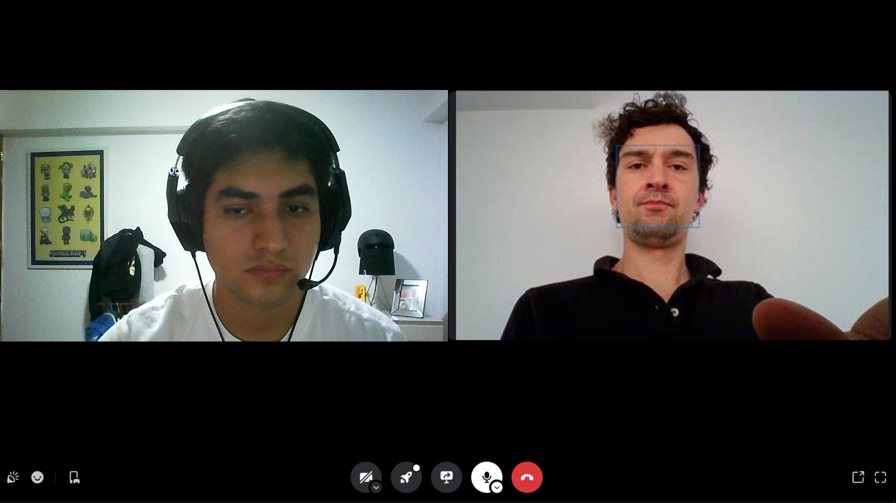
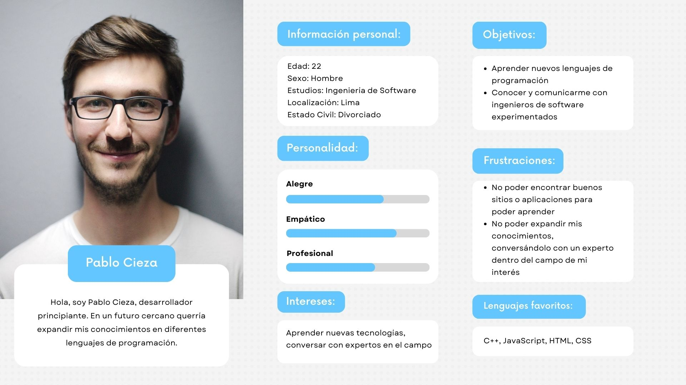
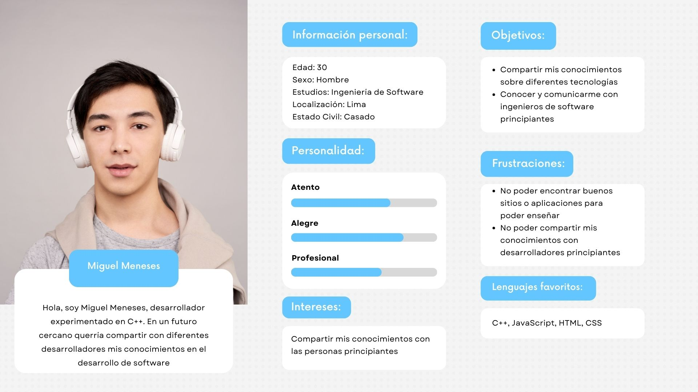
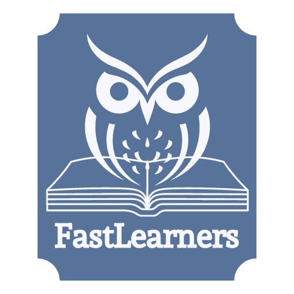
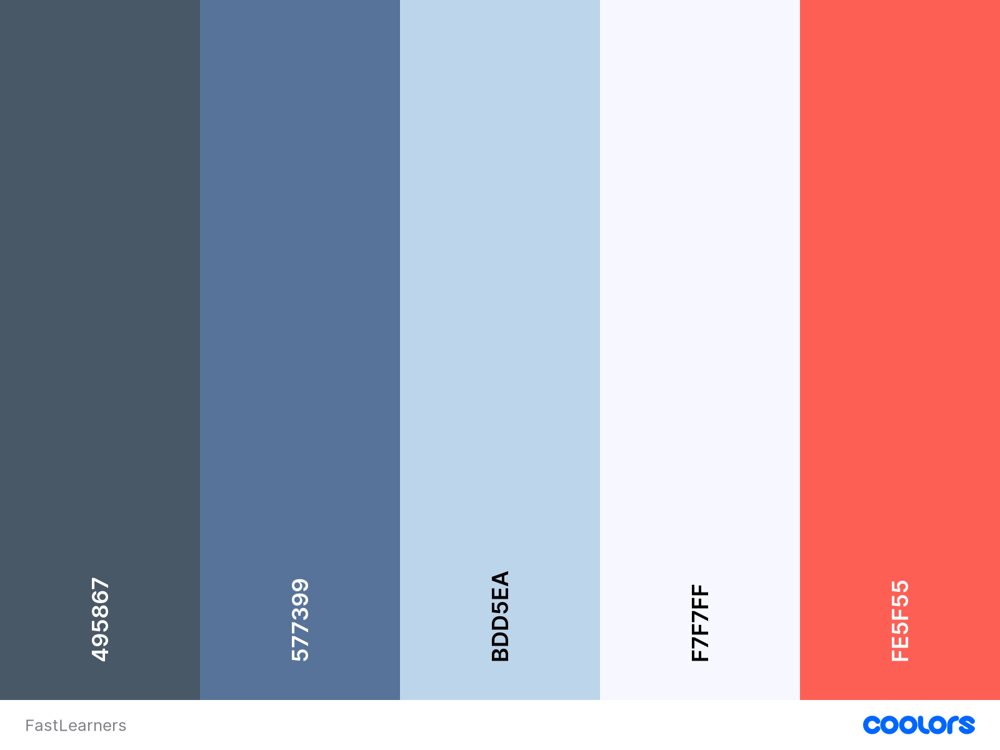
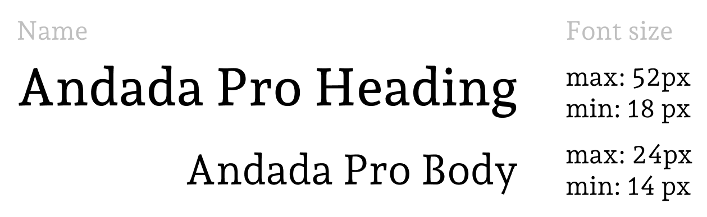
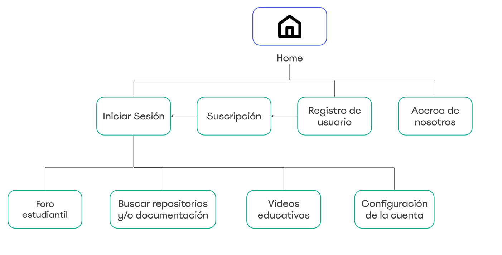
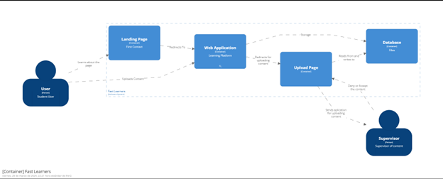
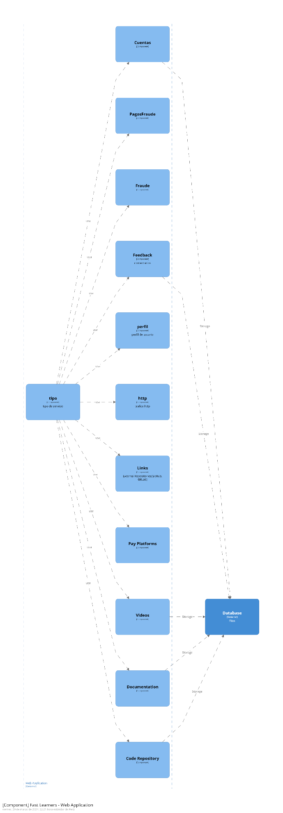
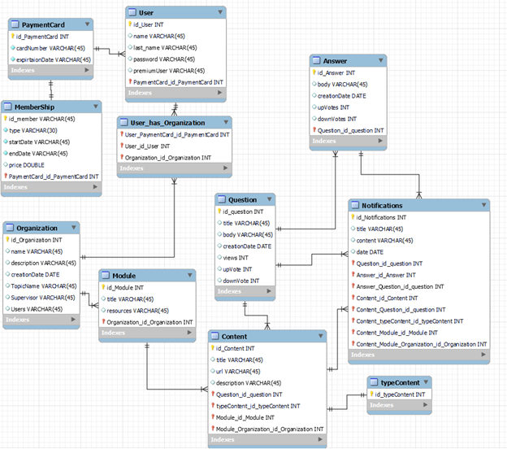

# UPC

# INGENIERÍA DE SISTEMAS DE SOFTWARE

## CURSO: SI729 Aplicacioes Open Source | SECCIÓN SW58
 Profesor: Efrain Ricardo Bautista Ubillus

# Informe de TB1
**Startup:** FastLearners

### Integrantes:
- Javier Murillo, Mathias - u202022211
- Orrego Noriega, Jorge David - u201921734
- Ochoa Colonio, Carlos Alberto - u202315945
- Pachas Chavez, Alejandro Alberto - u201917598
- Mendez Rosales, Marco Aurelio - u202018273

---
# Registro de Versiones del Informe
| Version | Fecha | Autor | Descripcion de Modificacion |
| ----------- | ----------- | ----------- | ----------- |
| 0.0 | 25/03/2024 |Grupo 4 |Se crea el documento |

# Project Report Collaboration Insights
[URL del repositorio](xxx)

(Imagenes de los commits cada entrega)

# Student Outcome
|Criterio Especifico|Acciones Realizadas|Conclusiones|
|-|-|-|
|Participa en equipos multidisciplinarios con eficacia, eficiencia y objetividad, en el marco de un proyecto en soluciones de ingeniería de software.|Carlos Ochoa:<br> *TB1:*  Me enfoqué en el Startup Profile, la misión, la visión, los antecedentes y problemática de manera objetiva<br> *TB2:* texto etc.. |Se evidenció la problemática y se identificó el segmento objetivo|
|Conoce al menos un sector empresarial o dominio de aplicación de soluciones de software.|Carlos Ochoa:<br> *TB1:*  Desarrollé el apartado del Lean UX Process<br> *TB2:* texto etc.. |Se logró desarrollar las hipotesis de negocio|

# Capítulo I: Introducción

## 1.1. Startup Profile
A continuación presentaremos el perfil de la Start Up y los perfiles de los integrantes

### 1.1.1. Descripción de la Startup
Nuestra Start Up, llamada FastLearners, es una startup innovadora en el ámbito del aprendizaje tecnológico, diseñada para facilitar una plataforma de aprendizaje colaborativo exclusiva para programadores e ingenieros de software. A través de nuestra plataforma, los usuarios pueden compartir y acceder a una amplia gama de recursos educativos, como repositorios de código, documentación técnica y videos educativos. Nuestro enfoque se centra en la colaboración y el intercambio de conocimientos, permitiendo a los usuarios tanto aprender de forma autónoma como contribuir al aprendizaje colectivo. Adoptamos un modelo de negocio freemium, que permite a los usuarios acceder gratuitamente a una serie de recursos, con la opción de desbloquear características adicionales, como acceso a repositorios exclusivos, videos avanzados y documentación especializada, mediante una suscripción mensual. FastLearners se compromete a mantenerse a la vanguardia del desarrollo tecnológico, ofreciendo constantemente contenido actualizado y relevante para nuestra comunidad de aprendizaje en constante expansión.

#### FastLearners
- **Misión:**
La misión de FastLearners es democratizar el acceso al conocimiento tecnológico, proporcionando una plataforma colaborativa donde programadores e ingenieros de software de todos los niveles puedan mejorar sus habilidades, compartir su experiencia y avanzar en sus carreras. Nos esforzamos por crear un entorno inclusivo y accesible, donde la pasión por el aprendizaje y el desarrollo de software se cultive y celebre. A través de nuestra oferta de recursos educativos de alta calidad y la promoción de una comunidad de aprendizaje activa, nos comprometemos a empoderar a los individuos para que alcancen su máximo potencial en el mundo tecnológico.
- **Visión:**
Nuestra visión es convertirnos en el principal recurso y comunidad en línea para el aprendizaje colaborativo de programación y desarrollo de software. Aspiramos a ser reconocidos a nivel mundial como la plataforma de elección para programadores e ingenieros de software que buscan mejorar sus habilidades, descubrir las últimas tendencias tecnológicas y colaborar en proyectos innovadores. En FastLearners, nos proponemos liderar la transformación en la educación tecnológica, eliminando barreras para el acceso al conocimiento y fomentando una cultura de aprendizaje continuo y colaboración. Nuestra visión a largo plazo incluye la expansión de nuestra oferta de recursos y herramientas educativas, asegurando que todos, desde principiantes hasta expertos, tengan las oportunidades y el apoyo necesarios para prosperar en la era digital.

#### 1.1.2. Perfiles de integrantes del equipo
|Miembros del equipo | Codigo Estudiante | Carrera | Conocimientos / Habilidades |
|-|-|-|-| 
|Javier Murillo, Mathias |u202212096|Ingenieria de software|C++, SQL, React, Python, Javascript|
|Orrego Noriega, Jorge David |u201921734|Ingenieria de software|C++, Python, SQL y Java|
|Pachas Chavez, Alejandro Alberto |u201917598|Ingenieria de software|C++, React, Laravel,HTML5, CSS3, Javascript, SQL, Docker|
|Ochoa Colonio, Carlos Alberto |u202315945|Ingenieria de software|C++, Python, creativo y amigable|
|Mendez Rosales, Marco Aurelio |u202018273|Ingenieria de software|C++, Python, SQL, Azure, Trabajador|
<!--cambien la url e info, se agrego estilos para evitar errores en las dimensiones -->

## 1.2. Solution Profile

### 1.2.1 Antecedentes y problemática
- **Antecedentes:**<br>
La integración de la tecnología en la educación ha demostrado tener un impacto significativo en los resultados del aprendizaje, aunque su efectividad varía considerablemente según el tipo de tecnología utilizada, la geografía, y si los dispositivos están en manos de los profesores o los estudiantes. Por ejemplo, el uso de proyectores de datos e internet en las aulas se correlaciona con un rendimiento casi un nivel de grado mejor en la evaluación PISA, mientras que el uso de laptops y tabletas por parte de los estudiantes muestra resultados mixtos, dependiendo del sujeto y la región. En particular, en Estados Unidos, los estudiantes que usan laptops en el aula puntúan 17 puntos PISA más alto que aquellos que no lo hacen, sugiriendo que el contexto educativo y la forma en que se integra la tecnología son factores críticos para su éxito​ (McKinsey & Company)​.

La creciente aceptación de programas de certificación y ofertas educativas no tradicionales entre los aprendices adultos también resalta la necesidad de una educación más integrada y flexible que combine programas de grado y no grado. Instituciones como la City University of New York (CUNY) han lanzado programas que integran credenciales de micro-certificación con programas de grado tradicionales, apuntando a una educación más alineada con las habilidades específicas demandadas por los empleadores​ (McKinsey & Company)​.

- **Problemática**<br>
A pesar de los avances tecnológicos, persisten limitaciones significativas en la implementación efectiva de la tecnología educativa. Estas limitaciones incluyen la dificultad de discernir los efectos específicos de diferentes componentes de programas tecnológicos, como videos instructivos frente a ejercicios prácticos, y el desafío de determinar el impacto del tiempo adicional de instrucción frente a la oportunidad real de práctica. Además, el compromiso del estudiante con el material puede verse afectado por la presentación tradicional de la instrucción en comparación con métodos más interactivos y atractivos, como la gamificación y los tutoriales en video para el aprendizaje autónomo​ (Brookings)​.


- **¿Qué?**<br>
El núcleo del problema radica en la inaccesibilidad y limitaciones de la educación tecnológica especializada y colaborativa. Se identifica una necesidad imperiosa de plataformas capaces de ofrecer no solo recursos educativos de alta calidad, sino también la oportunidad de interacción en tiempo real y un entorno de aprendizaje colaborativo. Estos elementos son fundamentales para el desarrollo eficaz de habilidades en programación y desarrollo de software, satisfaciendo así una demanda creciente en la industria tecnológica actual

- **¿Quién?**<br>
Los principales afectados son:
 Programadores e ingenieros de software en todos los niveles de habilidad, buscando mejorar o actualizar sus conocimientos.
 Estudiantes de tecnología y ciencias de la computación que requieren recursos adicionales fuera del aula.
 Profesionales de tecnología en transición a nuevas especializaciones o actualizando sus competencias.

- **¿Por qué?**<br>
La principal causa de esta problemática es la escasez de plataformas educativas tecnológicas que logren integrar eficientemente aprendizaje colaborativo, recursos actualizados y herramientas interactivas para una formación técnica de calidad. Esta carencia se traduce en una barrera significativa para el desarrollo profesional continuo y la innovación tecnológica

- **¿Dónde?**<br>
Este desafío se presenta a nivel global, afectando especialmente a aquellos en comunidades con recursos limitados o acceso restringido a educación tecnológica de alta calidad. La problemática es prevalente tanto en entornos de autoaprendizaje como en contextos educativos formales, abarcando una amplia gama de situaciones y necesidades de aprendizaje

- **¿Cuándo?**<br>
Este problema persiste a lo largo de toda la trayectoria profesional de los individuos en el campo tecnológico, manifestándose especialmente cuando buscan actualizar sus conocimientos o expandir su dominio sobre nuevas tecnologías y metodologías de desarrollo

- **¿Cómo?**<br>
La situación actual es consecuencia de un modelo educativo que no ha conseguido adaptarse al ritmo acelerado de evolución tecnológica, manteniendo barreras económicas y geográficas y una insuficiente promoción del aprendizaje colaborativo y la actualización continua de conocimientos

- **¿Cuánto?**<br>
Según la Asociación de la Industria de Software (no real, ejemplo para ilustración), la escasez de talento en áreas clave de tecnología podría costar a la economía global más de $450 mil millones anuales, limitando severamente la innovación y el crecimiento económico. Esta escasez se traduce en aproximadamente 1 millón de puestos de trabajo tecnológicos vacantes cada año, exacerbando la brecha de habilidades en la industria​ (McKinsey & Company)

### 1.2.2 Lean UX Process.
#### 1.2.2.1. Lean UX Problem Statements.
En el contexto actual, enfrentamos la imperiosa necesidad de crear una plataforma innovadora diseñada para revolucionar el aprendizaje tecnológico. Esta solución es fundamental para abordar el problema de acceso limitado y la ineficiencia en la educación especializada en programación y desarrollo de software, que obstaculiza el progreso de individuos en todo el espectro de habilidades tecnológicas. A pesar de la creciente demanda de profesionales tecnológicos cualificados, las opciones de aprendizaje disponibles no satisfacen las necesidades de un aprendizaje flexible, actualizado y colaborativo, dejando a muchos sin la oportunidad de avanzar en sus carreras o de adaptarse a nuevas tecnologías.

Hemos identificado que la falta de una plataforma que integre efectivamente recursos educativos de calidad, interacción en tiempo real y un ambiente de aprendizaje colaborativo contribuye significativamente a esta brecha educativa. Esto no solo limita el desarrollo personal y profesional de los programadores e ingenieros de software sino que también repercute negativamente en la capacidad de innovación y crecimiento en el sector tecnológico.

¿Cómo podemos, entonces, desarrollar una plataforma que ofrezca una solución comprensiva a estos desafíos, proporcionando un medio accesible, interactivo y colaborativo para el aprendizaje tecnológico, y facilitando así un proceso de educación más eficiente, actualizado y alineado con las necesidades del mercado laboral tecnológico?

#### 1.2.2.2. Lean UX Assumptions.
|Business Assumptions|User Assumptions|
|-|-|
|Market Demand: Existe una demanda significativa y creciente de educación tecnológica especializada, particularmente en áreas de programación y desarrollo de software, que no está siendo completamente satisfecha por las soluciones educativas tradicionales o en línea existentes.<br>
Modelo de Negocio: Un modelo freemium, que ofrece acceso básico gratuito con opciones de suscripción de pago para contenido avanzado y características adicionales, será efectivo en atraer una base de usuarios amplia y diversa, y luego convertir una porción significativa de esos usuarios en suscriptores pagos.<br>
Tecnología y Accesibilidad: Desarrollar una plataforma tecnológicamente avanzada pero accesible y fácil de usar para personas con diferentes niveles de habilidad técnica contribuirá directamente al crecimiento y retención de usuarios.<br>
Colaboración y Comunidad: Facilitar un entorno de aprendizaje colaborativo, con oportunidades para la interacción entre pares y el acceso a expertos, aumentará el compromiso del usuario y el valor percibido de la plataforma. |Necesidades de Aprendizaje: Los usuarios prefieren un enfoque de aprendizaje flexible y autodirigido que les permita avanzar a su propio ritmo, volver sobre material difícil y explorar áreas de interés personal en mayor profundidad.<br>
Búsqueda de Comunidad: Hay una fuerte demanda entre programadores e ingenieros de software, tanto novatos como experimentados, por una comunidad de apoyo donde puedan compartir conocimientos, resolver problemas juntos y formar conexiones profesionales.<br>
Preferencias de Contenido: Los usuarios valoran altamente el contenido educativo que es simultáneamente profundo, actualizado con las últimas tendencias y tecnologías, y aplicable a proyectos del mundo real.<br>
Barreras de Acceso: La falta de recursos educativos asequibles y de alta calidad es una barrera significativa para muchos que buscan entrar o avanzar en el campo tecnológico, especialmente para aquellos en comunidades con menos recursos. |

#### 1.2.2.3. Lean UX Hypothesis Statements.
- **Hipótesis 1:**<br>
Estamos convencidos de que nuestra plataforma de automatización contribuirá a una reducción significativa de los fraudes inmobiliarios en Perú. Esperamos ver una disminución del 10% en el promedio de casos reportados de estafas inmobiliarias al finalizar el primer año. El indicador de éxito será la comparación de las estadísticas de fraude antes y después de la implementación de nuestra solución.

- **Hipótesis 2:**<br>
Creemos que la integración de tecnología Blockchain y Smart Contracts agilizará los procesos contractuales, incrementando tanto la velocidad como la transparencia para los usuarios. Nuestro objetivo es reducir el tiempo promedio de transacciones de compraventa en un 50%. Validaremos esta hipótesis si, después de seis meses, el tiempo promedio de procesamiento de contratos refleja esta mejora significativa.

- **Hipótesis 3:**<br>
Suponemos que al formar alianzas estratégicas con la SUNARP y otras entidades gubernamentales para difundir nuestro servicio, fortaleceremos nuestra reputación y visibilidad en el mercado. Consideraremos que hemos alcanzado el éxito si logramos captar al menos 100 nuevos clientes en los primeros tres meses, y estos completan exitosamente sus procesos contractuales a través de nuestra plataforma.

- **Hipótesis 4:**<br>
Presumimos que implementar un sistema de calificaciones y reseñas para los usuarios en nuestra plataforma incrementará la confianza y satisfacción general. Este éxito se medirá por un aumento del 25% en la retención de usuarios y una valoración promedio de satisfacción superior a 4.5 sobre 5 en el curso de los primeros seis meses tras su implementación.

#### 1.2.2.4. Lean UX Canvas.
- **Business Problem Statement:**<br>
La digitalización ha transformado radicalmente el acceso a la educación, creando una demanda insatisfecha de aprendizaje tecnológico especializado y colaborativo en línea. FastLearners busca abordar la falta de una plataforma integral que ofrezca no solo recursos educativos de alta calidad sino también un entorno colaborativo que fomente la interacción y el crecimiento conjunto entre programadores e ingenieros de software de todos los niveles.

- **Business Outcomes:**<br>
Se busca lograr un aumento del 30% en la retención de usuarios activos mes a mes y un incremento del 40% en la conversión de usuarios gratuitos a suscriptores pagos dentro del primer año, reflejando un cambio significativo en el comportamiento de los usuarios hacia un compromiso más profundo y a largo plazo con la plataforma.

- **Users:**<br>
Nuestros usuarios son una mezcla diversa de autodidactas, estudiantes de ciencias de la computación, y profesionales en transición que buscan mejorar sus habilidades técnicas. Se incluyen tanto aquellos en busca de introducción a la programación como expertos buscando especializarse aún más.

- **User Outcomes and Benefits:**<br>
Los usuarios de FastLearners disfrutarán de un acceso más rápido y directo a recursos educativos actualizados, una comunidad de apoyo para resolver problemas y dudas, y oportunidades para proyectos colaborativos. Esto se traduce en una mejora tangible en sus habilidades técnicas y en su capacidad para mantenerse al día con las tendencias tecnológicas emergentes.

- **Solutions:**<br>
La solución incluye la creación de un repositorio extenso de recursos educativos, una plataforma para proyectos colaborativos y foros de discusión, así como herramientas interactivas que promuevan un aprendizaje práctico y aplicado. Se considerará también la integración de tecnologías emergentes para facilitar un aprendizaje más inmersivo.

- **Hypotheses:**<br>
Creemos que ofrecer un entorno de aprendizaje interactivo y colaborativo aumentará la retención de usuarios y fomentará la transición de usuarios gratuitos a pagos. También suponemos que al alinear estrechamente los contenidos educativos con las demandas del mercado laboral tecnológico, podemos aumentar la satisfacción y el éxito profesional de nuestros usuarios.

- **What’s the most important thing we need to learn first?:**
Necesitamos entender profundamente las necesidades específicas de aprendizaje y las preferencias de nuestros usuarios objetivo para asegurar que nuestro contenido y características de la plataforma sean lo más relevantes y valiosos posible desde el lanzamiento.

- **What’s the least amount of work to learn the next most important thing?:**
Realizar entrevistas detalladas y encuestas con una muestra representativa de nuestro público objetivo. Podría complementarse con pruebas A/B en características clave de la plataforma para recopilar rápidamente feedback valioso y ajustar nuestra oferta antes del lanzamiento oficial.

## 1.3. Segmentos objetivo.
| | Segmento 1 | Segmento 2  |
| - | - |-|
| Variables                 | Estudiantes de Ingeniería de Software y Programación | Profesionales de Tecnología en Transición |
| Geográfica                | Global, con un enfoque especial en regiones con un fuerte ecosistema de startups tecnológicas y universidades que ofrezcan programas avanzados en ingeniería de software y programación | Concentrados en centros tecnológicos globales y mercados emergentes con industrias tecnológicas en crecimiento |
| Demográfica               | Tienen entre 18 y 30 años, cursando estudios universitarios o recién graduados, con una distribución de género que refleja la creciente diversidad en el campo tecnológico | Profesionales de entre 25 y 45 años, con experiencia previa en el sector tecnológico que buscan actualizar sus habilidades o pivotar hacia nuevas especializaciones en programación y desarrollo de software |
| Psicológica               | Motivados por el deseo de innovar y contribuir al desarrollo tecnológico. Son entusiastas de la tecnología que valoran el aprendizaje continuo y están siempre buscando adquirir nuevas habilidades que les permitan estar a la vanguardia de las tendencias tecnológicas | Estos profesionales tienen una visión de crecimiento a largo plazo en su carrera, buscando no solo mantener su relevancia en un mercado laboral cambiante sino también posicionar-se como líderes y expertos en nuevas tecnologías |
| Función de comportamiento | Activamente buscan recursos en línea para complementar su educación, participan en hackathons, contribuyen a proyectos de código abierto y prefieren plataformas que ofrecen contenido práctico y actualizado, así como la oportunidad de trabajar en proyectos reales | Prefieren aprendizaje práctico y basado en proyectos que puedan aplicar de inmediato en su trabajo. Son activos en comunidades profesionales, participan en conferencias tecnológicas y buscan certificaciones que validen sus nuevas habilidades |

---

# Capítulo II: Requirements Elicitation & Analysis
## 2.1. Competidores.
# Stack Overflow
Stack Overflow es una plataforma de preguntas y respuestas para desarrolladores de software. Permite a los usuarios hacer preguntas sobre programación y recibir respuestas de la comunidad. La plataforma está organizada por categorías y etiquetas, facilitando la búsqueda de soluciones.

# Quora
Quora es una plataforma de preguntas y respuestas donde los usuarios pueden hacer preguntas sobre una amplia gama de temas y recibir respuestas de la comunidad. Las preguntas y respuestas son organizadas por temas y los usuarios pueden seguir temas y personas para personalizar su experiencia. Quora también permite a los usuarios escribir respuestas largas y detalladas, fomentando el intercambio de conocimientos y experiencias.

### 2.1.1. Análisis competitivo.

| Competitive Analysis Landscape                          |  |
| ------------------------------------------------------- | -|
| ¿Por qué llevar a cabo este análisis?                   | LLevamos a cabo este analisis competitivo, para poder darnos cuenta de nuestras ventajas y desventajas dentro del mercado con competidores que cuentan con un modelo de negocio similiar o parecido al nuestro. |


| |  | FastLearners | Stack Overflow  | Quora |
|-|-|-|-|-|
| PERFIL| Overview | Somos una plataforma de aprendizaje en la que distintos programadores e ingenieros de software pueden colaborar entre sí para aprender a través de repositorios, documentacion o videos educativos. El modelo de negocio es freemium, en el cual se podrán desbloquear distintas características como acceder a nuevos repositorios, videos o documentacion, todo esto con una suscripcion mensual. | Stack Overflow es una plataforma de preguntas y respuestas para desarrolladores de software. Permite a los usuarios hacer preguntas sobre programacion y recibir respuestas de la comunidad. | Quora es una plataforma de preguntas y respuestas donde los usuarios pueden hacer preguntas sobre una amplia gama de temas y recibir respuestas de la comunidad. |
|| Ventaja competitiva ¿Qué valor ofrece a los clientes? |  Enfoque especifico en el aprendizaje colaborativo entre programadores e ingenieros de software | Sistema de reputacion y gamificación motivando a la participación y calidad de respuestas | Abarca variedad de temas más allá de la programación, lo que permite a los usuarios explorar diversos temas |
|| Mercado Objetivo                                        | Programadores e ingenieros de software, que busquen mejorar sus habilidades tecnicas | Desarrolladores de software y programadores de todos los niveles de experiencia | Usuarios interesados en el intercambio de conocimientos y experiencias en diversos temas |
| Perfil de marketing                                     | Estrategia de Marketing | Redes Sociales y Publicidad Web | Publicidad dirigida y Patrocinios y asociaciones | Contenido Patrocinado y Participacion en la comunidad |
| Perfil del producto                                     | Productos y servicios | Plataforma de aprendizaje para desarrolladores principiantes, con modelo de negocio Freemium | PLataforma de Q&A para programadores de todo nivel de experiencia en temas de tecnologia | Plataforma de Q&A para personas interesadas en variados temas en campos variados |
|| Precios y costos                                        | Freemium (Cuenta Premium permite visualizar material de aprendizaje extra) Gratis | Gratuito | Gratuito |
|| Canales de distribución (Web y/o Móvil)                 | Web y Móvil Web | Web y Móvil Web | Web y móvil Web |
### 2.1.2. Estrategias y tácticas frente a competidores.


|Competidores ->|  | FastLearners | Stack Overflow | Quora |
|-|-|-|-|-|
| Análisis SWOT | Fortalezas | Enfoque especifico en el aprendizaje colaborativo para programadores e ingenieros de software | Comunidad activa y diversa de desarrolladores con alta experiencia técnica | Extensa variedad de temas expuestos, dando libertad al usuario de descubrir |
|| Debilidades   | Dependencia de la participacion activa de la comunidad de desarrolladores para mantener la utilidad del contenido | La experiencia de usuario puede variar dependiendo de la calidad y relevancia de las respuestas hechas por la comunidad | Usuarios pueden utilizarla para promover intereses personales, lo que puede disminuir la calidad del producto | 
|| Oportunidades | Colaboraciones con empresas y universidades para ofrecer contenido exclusivo y certficaciones en linea | Expansión hacia otros campos técnicos más allá del desarrollo de software | Mejora de experiencia de usuario, por medio de implementacion de caracteristicas adicionales | 
|| Amenazas      | Competencia creciente de otras empresas y startups que ofrecen servicios similares | Riesgo de contenido desactualizado que pueda afectar la credibilidad de la plataforma | Riesgo de contenido controvertido que pueda dañar la reputacion de la plataforma |

## 2.2. Entrevistas.
### 2.2.1. Diseño de entrevistas.
**Preguntas generales:**
1. ¿Cuál es su nombre? 
2. ¿Qué edad tiene? 
3. ¿A qué se dedica? 
4. ¿Sabes o has intentado aprender algun lenguaje de programacion? 

**Entrevistas Desarrollador Principiante**
1. ¿Estas o has estado interesado en aprender algun lenguaje de programacion?
2. ¿Cuando buscas informacion sobre un lenguaje, te es facil buscarla? Y si, sí ¿Es de fiar?
3. ¿Crees que se te facilitaria el aprendizaje, si fuera de manera cooperativa?
4. ¿Conoces alguna plataforma que te facilite el aprendizaje cooperativo?  
   
**Entrevistas Desarrollador Experto**
1. ¿Que tecnologicas tienes bajo tu entendimiento? 
2. ¿Te fue fácil aprender en su momento?
3. ¿Estarias interesado en compartir tu experiencia en distintas tecnologias con un publico abierto?
4. ¿Conoces alguna plataforma que facilite el aprendizaje cooperativo?

### 2.2.2. Registro de entrevistas.
**Desarrollador Principiante**  
Nombre: Pablo Cieza de Leon
Edad: 23 años 
Ocupación: Desarrollador de Software en JavaScript



**Desarrollador Experto**  
Nombre: Rodrigo Castillo
Edad: 30 años 
Ocupación: Desarrollador de Software en C++ 


### 2.2.3. Análisis de entrevistas.
**Desarrollador Principiante:**
En esta entrevista tuvimos la oportunidad de entrevistar a Andres, el es un desarrollador de software en JavaScript, en este momento esta haciendo sus practicas en una empresa de desarrollo, como el nos comenta es principiante en el desarrollo en JS. El nos comenta que es muy complicado encontrar alguna plataforma en la cual pueda encontrar documentos multimedia, con los cuales poder mejorar sus habilidades. Tambien nos dice que estaria interesado en poder encontrar algun foro en el cual se pueda hacer consultas a desarrolladores expertos, sobre sus problemas o dudas. 
**Desarrollador Experto:**
En esta ocasion tuvimos el placer de conversar con Rodrigo, el cuenta con mas de 8 años desarrollando software con el lenguaje C++, el nos comenta que en sus inicios le fue muy complicado encontrar donde aprender o mejorar sus habilidades y que le gusta la idea de contar con una plataforma en la cual pueda compartir los documentos que cree que le pueden subir a sus compañeros desarrolladores principiantes o menos experimentados y al mismo tiempo poder poder resolver sus consultas. 

## 2.3. Needfinding.
### 2.3.1. User Personas.
**Segmento 1:** Desarrolladores principiantes con dificultades de encontrar respuestas de expertos en el tema.  


**Segmento 2:** Desarrolladores experimentados con las ganas de poder ayudar a los principiantes en su campo.


### 2.3.2. User Task Matrix.
**Desarrolladores principiantes:** 
|  |  User 1  | User 2 | User 3  | User 4 |
| --- | ----------- | ------------ | ----------- | ---------- |
| Sabe màs de un lenguaje de programaciòn  | <span style="color:#90D26D; font-weight:bold">SI</span>   | <span style="color:#FFC700; font-weight:bold">NO</span>| <span style="color:#90D26D; font-weight:bold">SI</span>   | <span style="color:#90D26D; font-weight:bold">SI</span> |
| Conoce plataformas de aprendizaje cooperativo | <span style="color:#FFC700; font-weight:bold">NO</span> | <span style="color:#E72929; font-weight:bold">NO</span>        | <span style="color:#FFC700; font-weight:bold">SI</span>         | <span style="color:#E72929; font-weight:bold">NO</span>       |
| Tiene contancto con desarrolladores experimentados en su campo | <span style="color:#90D26D; font-weight:bold">SI</span> | <span style="color:#90D26D; font-weight:bold">SI</span>        | <span style="color:#FFC700; font-weight:bold">NO</span>         | <span style="color:#90D26D; font-weight:bold">SI</span>       | 
| Tiene donde hacer sus consultas y espera respuestas de expertos | <span style="color:#FFC700; font-weight:bold">SI</span> | <span style="color:#FFC700; font-weight:bold">NO</span>        | <span style="color:#FFC700; font-weight:bold">NO</span>         | <span style="color:#E72929; font-weight:bold">NO</span>       |

**Desarrolladores expertos:** 
|  |  User 1  | User 2 | User 3  | User 4 |
| --- | ----------- | ------------ | ----------- | ---------- |
| Es senior en algun lenguaje de programacion  | <span style="color:#90D26D; font-weight:bold">SI</span>   | <span style="color:#90D26D; font-weight:bold">SI</span>| <span style="color:#90D26D; font-weight:bold">SI</span>   | <span style="color:#90D26D; font-weight:bold">SI</span> |
| Tiene mas de 10 años de experiencia con un lenguaje de programacion | <span style="color:#E72929; font-weight:bold">NO</span> | <span style="color:#E72929; font-weight:bold">NO</span>        | <span style="color:#FFC700; font-weight:bold">POCO</span>         | <span style="color:#E72929; font-weight:bold">NO</span>       |
| Le gusta compartir sus experiencias y conocimientos con los demas | <span style="color:#90D26D; font-weight:bold">SI</span> | <span style="color:#90D26D; font-weight:bold">SI</span>        | <span style="color:#FFC700; font-weight:bold">POCO</span>         | <span style="color:#90D26D; font-weight:bold">SI</span>       | 
| Sabe donde compartir sus conocimientos | <span style="color:#90D26D; font-weight:bold">SI</span> | <span style="color:#90D26D; font-weight:bold">SI</span>        | <span style="color:#90D26D; font-weight:bold">SI</span>         | <span style="color:#90D26D; font-weight:bold">SI</span>       |
### 2.3.3. User Journey Mapping.
**Registration:**
Why would they trust us?
- Investigan sobre la plataforma
- Leen opiniones o testimonios
- Verifican la credibilidad de lo que proporcionamos
  
**Onboarding and first use:**
How can they feel successful?
- Completan el proceso de incorporacion claro y facil de usar
- Navegan facilmente sobre la plataforma
- Reciben orientacion inmediata o tutoriales sobre lo basico 
  
**Sharing:**
Why would they invite others?
- Encuentran caracteristicas que mejoran la colaboracion o interaccion social
- Encuentran valor sobre el contenido de la plataforma
- Reciben incentivos o recompensas por invitar a otros

### 2.3.4. Empathy Mapping.
**Desarrollador Principiante:**


**Desarrollador Experto:**

### 2.3.5. As-is Scenario Mapping.

**Desarrollador Principiante**  
Escenario: El desarrollador principiante esta aprendiendo a desarrollar aplicaciones web utilizando HTML, CSS y JavaScript mediante un curso en linea

As Is:
| Fases| Fase 1 | Fase 2| Fase 3| Fase 4|
| -------- | --------- | --------- | ------- | --------- |
| Doing | Viendo videos de introduccion a HTML| Practicando HTML basico | Aprendiendo sobre diferentes estilos con CSS | Completando ejercicios de JavaScript|
| Thinking | "¿Como puedo armar correctamente una pagina web con HTML?"| "¿Que elementos debo usar para mi pagina web?" | "¿Como puedo hacer mi web responsive?" | "¿Como puedo utilizar funciones en JavaSript?" |
| Feeling  | Emocionado por aprender desarrollo web| Intrigado por las posibilidades de diseño con CSS | Confundido por la dificultad de CSS | Motivado por enteder JavaScript |

**Desarrollador Experto**  
Escenario: El desarrollador experto esta liderando el desarrollo de una aplicacion movil para una empresa importante

As Is:
| Fases| Fase 1 | Fase 2| Fase 3| Fase 4|
| -------- | --------- | --------- | ------- | --------- |
| Doing | Revisando los requisitos del proyecto y estableciendo objetivos| Diseñando la estructura de la aplicacion y estableciendo APIs | Dirigiendo al equipo, implementando funcionalidades | Realizando pruebas y depuracion del codigo |
| Thinking | "¿Como podemos garantizar que la aplicacion cumpla con las expectativas del cliente?" | "¿Cual es la mejor manera de garantizar la estabilidad y eficiencia?" | "¿Como podemos optimizar el rendimiento de la aplicacion?" | "¿Que estrategias de prueba y depuracion utilizaremos?" |
| Feeling  | Comprometido con el exito del proyecto | Concentrado en encontrar soluciones rapidas | Confianza en el equipo para cumplir con los plazos | Determinado a superar cualquier problema |
## 2.4. Ubiquitous Language.
```
Desarrollador principiante:

Persona interesada en nuestra aplicacion para poder aprender a mejorar sus habilidades en la programacion y diferentes tecnologias.

Desarrollador experto:

Persona interesada en nuestra aplicacion para poder compartir su experiencia, trucos y/o material multimedia que ellos usaron y recomiendan para mejorar en su campo de trabajo. 
```

---

# Capítulo III: Requirements Specification
## 3.1. To-Be Scenario Mapping.

Segmento 1:

| Fases    |  fase 1 as is | fase 2| fase 3|
| -------- | ------- | ---- | ---------------- |
| Doing    |Los programadores e ingenieros de software se registran en la plataforma de aprendizaje y exploran los repositorios disponibles. | Algunos usuarios deciden desbloquear características premium y se suscriben mensualmente para acceder a contenido exclusivo. |Los usuarios colaboran entre sí en proyectos, comparten conocimientos y resuelven problemas juntos utilizando la documentación y los videos educativos disponibles.|
| Thinking |Los usuarios se sienten motivados al ver el progreso en sus habilidades de programación y desarrollo de software.| Aquellos que optan por la suscripción premium valoran la calidad del contenido exclusivo y consideran que vale la pena la inversión.| Los usuarios se sienten satisfechos al poder colaborar con otros profesionales de la industria y aprender de su experiencia. | texto| texto|
| Feeling  |Los usuarios experimentan un sentido de comunidad y pertenencia al colaborar con otros en la plataforma.|Se sienten empoderados al tener acceso a recursos educativos de alta calidad que les permiten mejorar sus habilidades y avanzar en sus carreras. | En general, los usuarios se sienten entusiasmados y motivados por el proceso de aprendizaje continuo que ofrece la plataforma. | texto| texto|

Segmento 2:
| Fases    |  fase 1 as is | fase 2| fase 3|
| -------- | ------- | ---- | ---------------- |
| Doing    | | texto| texto | texto| texto|
| Thinking | | texto| texto | texto| texto|
| Feeling  | | texto| texto | texto| texto|

## 3.2. User Stories.

| HU0X | Historia Usuario | Descripcion  |
|------|------------------|----------------|
|HU01|Como usuario nuevo, quiero poder registrarme en la plataforma para acceder a los recursos educativos.|Los usuarios nuevos podrán crear una cuenta en la plataforma proporcionando su nombre, dirección de correo electrónico y una contraseña.|
|HU02|Como usuario registrado, quiero poder explorar los repositorios disponibles en la plataforma para encontrar contenido relevante.|Los usuarios podrán navegar por los repositorios disponibles y ver una breve descripción de cada uno, así como la cantidad de contenido disponible en cada uno.|
|HU03|Como usuario, quiero poder suscribirme mensualmente para acceder a contenido premium en la plataforma.|Los usuarios podrán optar por una suscripción mensual que les permitirá acceder a contenido premium, como videos educativos exclusivos y documentación detallada.|
|HU04|Como usuario registrado, quiero poder colaborar con otros usuarios en proyectos para aprender y resolver problemas juntos.|Los usuarios podrán unirse a proyectos existentes o crear nuevos proyectos en los que otros usuarios puedan participar. Podrán compartir código, documentos y recursos para trabajar en equipo.|
|HU05|Como usuario suscrito, quiero poder acceder a contenido exclusivo que no está disponible para usuarios no suscritos.| usuarios con una suscripción mensual podrán acceder a contenido exclusivo, como videos educativos avanzados, tutoriales detallados y proyectos prácticos.|
|HU06|Como usuario, quiero poder valorar el contenido de la plataforma para ayudar a otros usuarios a encontrar material de calidad.|Los usuarios podrán valorar positiva o negativamente el contenido de la plataforma y dejar comentarios para compartir su opinión con otros usuarios.|
|HU07|Como usuario, quiero poder hacer un seguimiento de mi progreso en la plataforma para ver cómo estoy mejorando en mis habilidades.|Los usuarios podrán ver estadísticas y métricas relacionadas con su uso de la plataforma, como la cantidad de contenido consumido, los proyectos completados y las habilidades desarrolladas.|
## 3.3. Impact Mapping.


## 3.4. Product Backlog.

| #Orden | User Story ID | Titulo| Descripción| Story Points (1/2/3/5/8) |
| ------ | ------------- | ----- | ---------- | ------------------------ |
| 1      | HU01          | titulo his | desc  | 5                        |

# Capítulo IV: Product Design
## 4.1. Style Guidelines.
### 4.1.1. General Style Guidelines.

**Branding** 

**Brand Overview:**

Nuestra startup de nombre FastLearners está enfocada en ofrecer una solución que ayudar a desarrolladores novatos a aprender de una manera más dinámica y con el apoyo de profesionales. Para lograr esto se implementará una plataforma o sitio web en el cual se podrán encontrar material educativo (videos, repositorios, documentación, etc.) además de foros para fomentar la colaboración y el aprendizaje en conjunto de los usuarios. 

**Misión:** La misión de FastLearners es democratizar el acceso al conocimiento tecnológico, proporcionando una plataforma colaborativa donde programadores e ingenieros de software de todos los niveles puedan mejorar sus habilidades, compartir su experiencia y avanzar en sus carreras. Nos esforzamos por crear un entorno inclusivo y accesible, donde la pasión por el aprendizaje y el desarrollo de software se cultive y celebre. A través de nuestra oferta de recursos educativos de alta calidad y la promoción de una comunidad de aprendizaje activa, nos comprometemos a empoderar a los individuos para que alcancen su máximo potencial en el mundo tecnológico.

**Visión:** Nuestra visión es convertirnos en el principal recurso y comunidad en línea para el aprendizaje colaborativo de programación y desarrollo de software. Aspiramos a ser reconocidos a nivel mundial como la plataforma de elección para programadores e ingenieros de software que buscan mejorar sus habilidades, descubrir las últimas tendencias tecnológicas y colaborar en proyectos innovadores. En FastLearners, nos proponemos liderar la transformación en la educación tecnológica, eliminando barreras para el acceso al conocimiento y fomentando una cultura de aprendizaje continuo y colaboración. Nuestra visión a largo plazo incluye la expansión de nuestra oferta de recursos y herramientas educativas, asegurando que todos, desde principiantes hasta expertos, tengan las oportunidades y el apoyo necesarios para prosperar en la era digital.

**Brand name:** 

El nombre de nuestra solución es FastLearners, que en español estaría traducido como “estudiantes o aprendices rápidos” por la intención de querer agilizar y dinamizar la tarea de aprender sobre el mundo del desarrollo de software. 

**Logo:** 

Hemos decidido utilizar un búho sentado en un libro dado que este animal es un símbolo de sabiduría, por lo cual queremos reflejar que nuestra plataforma es apta para adquirir y divulgar conocimientos. 



**Colores:**



**Enlace:** [Color Palette](https://coolors.co/495867-577399-bdd5ea-f7f7ff-fe5f55)

**Colores principales:**

Hemos decidido que los colores principales de la aplicación sean Glaucous (577399) y Ghost White (F7F7FF), con el objetivo de representar visualmente que FastLearners es una plataforma confiable para aprender y que a su vez ha sido desarrollada de la mejor manera posible. Lo que queremos transmitir en nuestros usuarios es que pueden confiar en nosotros en que la calidad del contenido y del funcionamiento del sitio web va a ser impecable. 

**Colores secundarios:** 

Como parte de los colores secundarios hemos elegido el Payne’s gray (495867), Columbia blue (BDD5EA) y Bittersweet (FE5F55). Los dos primeros los elegimos para complementar al color principal Glaucous y el último, dado su semejanza con el color rojo, lo elegimos para darle una vista más energética y estimulante a nuestros usuarios para aprender. 

**Tipografía:**

* Andada/Andada Pro



### 4.1.2. Web Style Guidelines.

**Elementos visuales (Imágenes y videos):**

Se van a incluir imágenes y videos con objetivos distintos. Las imágenes pueden variar desde íconos en un menú de opciones hasta la foto de perfil de un usuario. Los videos se van a implementar como una parte del contenido didáctico de la plataforma, el cual se podrá encontrar en una página dedicada al material audiovisual. 

**Botones:**

Como parte de la interacción del usuario con nuestro sitio web, es necesario implementar botones para confirmar o realizar una acción. Su diseño va a seguir lo impuesto en el apartado de General Style Guidelines, y se tendrán que distinguir fácilmente de otros apartados gráficos en las páginas web de la aplicación. Se van a poder encontrar en toda la implementación de la aplicación web, ya sea al final de un formulario o dentro de un menú de opciones. 

**Formularios:**

También se utilizarán formularios en páginas dedicadas al inicio de sesión, registro de usuario, subir documentos, etc. Estos se van a implementar de acuerdo al tipo de usuario que se ha identificado, que en nuestro caso sería un desarrollador principiante y uno experimentado. 

## 4.2. Information Architecture.
### 4.2.1. Organization Systems.

Para mostrar el contenido de nuestra plataforma hemos decidido utilizar una estructura jerárquica y secuencial, lo cual dependerá de la necesidad sobre cómo presentar la información al usuario. Por ejemplo, para el inicio de sesión y el registro del usuario se tendrá que hacer más énfasis en el formulario para ingresar los datos de registro y de ingreso, además de los botones para confirmar la acción. 
Por otra parte, las actividades principales o el “core” del negocio tendrán utilizar una estructura secuencial. Esto se puede evidenciar más en la funcionalidad del foro, ya que el usuario tiene que seguir una serie de pasos en específico para interactuar con la aplicación (crear un nuevo post, escribir un comentario en un post, calificar el comentario de un usuario, etc.).  Esta lógica es casi la misma con las demás funcionalidades de nuestra aplicación web como el manejo de repositorios compartidos (código o documentación) y la subida y consumo del material multimedia.



### 4.2.2. Labeling Systems.

Como parte del diseño de la aplicación, se utilizarán etiquetas en la parte superior de la página web para indicar cuál es el contenido que está viendo. Además, se podrá interactuar con ellas para acceder a las demás secciones y funcionalidades de la aplicación. 

**Etiquetas antes de iniciar sesión:** Iniciar sesión, Acerca de nosotros, Regístrate. 

**Etiquetas después de iniciar sesión:** Foro estudiantil, Buscar repositorios y/o documentación, Videos educativos, Configuración de la cuenta.

### 4.2.3. SEO Tags and Meta Tags

**Meta & SEO (Search Engine Optimization) Tags:** 

Los SEO (Search Engine Optimization) y Meta tags son datos que sirven para identificar nuestro sitio web, los cuales solo son leídos por los navegadores web o los rastreadores web. Además, ayudan a que nuestro sitio pueda ser visualizado en buscadores web como Google o Bing. 

**Título:**  ```<title> FastLearners ¡Aprende a codear con nosotros! </title>```

**Codificación:** ```<meta charset=”utf-8”>```

**Descripción:** ```<meta name=”descripcion” content=”FastLearners es una aplicación web que te permitirá aprender más sobre el mundo del desarrollo de software con expertos en el campo ¡Regístrate ya!” />```

**Meta Robots Tag:** ```<meta name= “robots” content=“index,follow”>```

**Meta Keywords Tag:** ```<meta name="keywords" content="learning, software, software development, forum, video, repository, programming, programming languages, engineering” />```

**Meta Author Tag:** 
* ```<meta name= “autor” content=“FastLearners”>```
* ```<meta name="copyright" content="Copyright FastLearners Group" />```

### 4.2.4. Searching Systems.

Los usuarios podrán buscar el tipo de contenido que deseen por medio de un menú que se presentará en la página principal del sitio luego de haber iniciado sesión. En esta encontrará las opciones entrar a los foros, buscar repositorios y/o documentación de cualquier tema, buscar videos relevantes y también poder modificar los datos de su cuenta. En cada uno de los tres primeros ítems se podrá filtrar la información en base al el tema de desarrollo, las herramientas de desarrollo utilizadas (lenguaje de programación, frameworks, etc.), la fecha de publicación, los tags y el autor del material.


### 4.2.5. Navigation Systems.

El sistema de navegación de nuestro sitio web consta de menús de navegación superior e inferior dentro de la landing page, en los cuales podrás elegir las opciones de inicio de sesión, registrarse, leer sobre el equipo de desarrollo y las suscripciones disponibles. También se podrá desplazar verticalmente por las páginas del sitio para mostrar más información. 

Luego de haber iniciado sesión, el usuario accederá a un menú de carácter jerárquico en el cual se mostrarán las opciones principales de la aplicación (Foro estudiantil, Buscar repositorios y/o documentación, Videos educativos, Configuración de la cuenta). Cada una de estas opciones te llevará a su respectiva página, de la cual podrás regresar al menú anterior seleccionando una opción de regresar a la siguiente página. Cada menú del sitio cuenta con botones que pueden ser distinguidos con facilidad de otros objetos en la interfaz, lo cual ayudará de una manera significativa con la navegación. 

## 4.3. Landing Page UI Design.
### 4.3.1. Landing Page Wireframe.
la pagina donde te registras y ves info del web app (te manda al web app)

Wireframe es todo lo funcional de la pagina


### 4.3.2. Landing Page Mock-up.
Mockup es todo lo relacionado al diseño de la pagina


## 4.4. Web Applications UX/UI Design.
### 4.4.1. Web Applications Wireframes.
lo funcional de cada aspecto del wireframe 


### 4.4.2. Web Applications Wireflow Diagrams.
Wireflow es como se va a navegar por la pagina (boton me lleva a esta pagina y este me regresa)


### 4.4.2. Web Applications Mock-ups.
Diseño en todo aspecto


### 4.4.3. Web Applications User Flow Diagrams.
un flow diagram de como el usuario utilizara la pagina **[PARA CADA USER GOAL]** 


## 4.5. Web Applications Prototyping.
[URL del Prototipo (Hecho en figma)](https://www.example.com)

## 4.6. Domain-Driven Software Architecture.
El objetivo del Domain Driven Design (DDD) es alcanzar una comprensión mutua del ámbito del problema, fomentando una visión compartida del dominio en cuestión. Al adoptar un enfoque diferente, DDD facilita una colaboración más efectiva entre los desarrolladores y los expertos en el dominio, al tiempo que promueve el uso de un lenguaje común. Además de esto, DDD implica la aplicación de una serie de procedimientos, patrones y diagramas de arquitectura para alinear el software con el dominio y fortalecer su enfoque.
### 4.6.1. Software Architecture Context Diagram.
1. System Context Diagram: Diagrama que muestra la relacion del aplicativo con los usuarios
se incluyen servicios externos (si hay pocos bounded context se incluyen ahi)

2. Bounded Context Map: Muestra la relacion entre bounded contexts (los bounded context son como una burbuja que encapsula palabras clave en los procesos para poder diferenciarlos [Ej. Bounded context enfocado en las ventas(ventas), otro en revisar el stock(gestion) y otro enfocado en los proveedores (suministros)]) Se hace como un brainstorm y se ve en que pueden conectarse o comunicarse [se usa un circulo entre conexiones lineales (upstream o downstream) para definir comunicacion, algunos context se pueden integrar para representar por ejemplo un share model por database, tambien se mencionan los (third party context para definir los restful apis)]

   
### 4.6.2. Software Architecture Container Diagrams.
1. Bounded Context Deployable / Container Diagrams. Sirve para entender como funciona y el proceso, Se especifican DB's, indexers, Search engine, las Apis que usen los bounded context y se conectan por flechas, las cuales tienen como objetivo explicar la direcion y relacion junto a que se esta enviando/comunicando (TCP) 

### 4.6.3. Software Architecture Components Diagrams.
1. Component diagrams: Estos van a mostrar las ordenes, procesos, mensajes y componentes utilizados en el uso del aplicativo, claro se deben hacer diferentes de estos para cada bounded o USER GOALS

## 4.7. Software Object-Oriented Design.
### 4.7.1. Class Diagrams.
Un diagrama de clases es una representación visual de las clases de un sistema de software y las relaciones entre ellas. 

### 4.7.2. Class Dictionary.
Para el diccionario de clases, se presentan las más importantes
# User

User representa los datos que el usuario debe completar con su información para registrarse.

| Atributo     | Descripción                              |
|--------------|------------------------------------------|
| Id           | int - Identificador único del usuario   |
| Name         | string - Nombre del usuario             |
| LastName     | string - Apellido del usuario           |
| Password     | string - Contraseña del usuario         |
| Email        | string - Correo del Usuario             |
| PremiumUser  | bool - Usuario Premium o No             |

## Métodos

| Método                           | Descripción                                                    |
|---------------------------------|----------------------------------------------------------------|
| changePassword(newPassword)     | void - Este método permite cambiar la contraseña del usuario   |
| ChangeEmail(newEmail)           | void - Este método permite cambiar el correo del usuario       |
| UpgradePremium(PremiumUser)     | void - Este método permite cambiar el estado del premium del usuario |

# Organization

Organization representa los datos de la organización creada por un usuario.

| Atributo       | Descripción                                        |
|----------------|----------------------------------------------------|
| Id             | int - Identificador único de la organización      |
| Name           | string - Nombre de la organización                 |
| CreationDate   | date - Fecha de creación de la organización        |
| TopicName      | String - Nombre del tema de la organización        |
| Users          | int - Cantidad de usuarios en la organización      |
| Supervisor     | String - Nombre del supervisor de la organización  |

## Métodos

| Método                                | Descripción                                                         |
|--------------------------------------|---------------------------------------------------------------------|
| addUser(newUser)                     | Void - Agrega un nuevo usuario a la organización                    |
| removeUser(in User)                  | void - Elimina un usuario de la organización                        |
| uploadContent()                      | void - Sube contenido a la organización                              |
| deleteContent(in content)            | void - Elimina contenido de la organización                          |
| uploadQuestion(in question, in content) | void - Sube una pregunta sobre un contenido específico             |
| answerQuestion(in question, in content, in answer) | void - Responde a una pregunta de un contenido específico     |
| closeQuestion(in idQuestion)         | void - Cierra una pregunta específica                                |
| upVoteQuestion(in question:Question) | void - Vota positivamente por una pregunta específica               |
| downVoteQuestion(in question:Question) | void - Vota negativamente por una pregunta específica             |
| SuperviseContent(in content:Content) | bool - Supervisa un contenido específico                            |

# Question

Question representa la clase de pregunta sobre un contenido específico.

| Atributo      | Descripción                                            |
|---------------|--------------------------------------------------------|
| Id            | string - Identificador único de la pregunta           |
| CreationDate  | date - Fecha de creación de la pregunta              |
| Title         | string - Título de la pregunta                        |
| Body          | string - Cuerpo o contenido de la pregunta            |
| Author        | User - Usuario que ha creado la pregunta              |

## Métodos

| Método                               | Descripción                                                        |
|-------------------------------------|--------------------------------------------------------------------|
| editQuestion(in newBody:String)     | void - Edita el cuerpo de la pregunta con el nuevo contenido proporcionado |
| addAnswer(in answer:Answer)         | void - Agrega una respuesta a la pregunta                         |

# NotificationManager

NotificationManager representa la clase de control de las notificaciones.

| Atributo       | Descripción                                                          |
|----------------|----------------------------------------------------------------------|
| notification   | Notification - Objeto de tipo Notification que representa la notificación |
| author         | User - Usuario (objeto de tipo User) que creó la notificación       |
| creationDate   | date - Fecha de creación de la notificación                         |

## Métodos

| Método                                | Descripción                                                      |
|--------------------------------------|------------------------------------------------------------------|
| sendNotification()                   | void - Envía la notificación                                    |
| createNotification(in User, in title, in content, in date) | void - Crea una notificación con los parámetros especificados |

# Notification

Notification representa la clase de notificaciones.

| Atributo       | Descripción                                            |
|----------------|--------------------------------------------------------|
| id             | int - Identificador único de la notificación          |
| title          | string - Título de la notificación                     |
| content        | string - Contenido o mensaje de la notificación       |
| date           | date - Fecha de la notificación                        |

# PaymentCard

PaymentCard representa la clase del método de pago.

| Atributo       | Descripción                                            |
|----------------|--------------------------------------------------------|
| id             | int - Identificador único del método de pago          |
| cardNumber     | String - Número de la tarjeta de pago                 |
| expireDate     | String - Fecha de vencimiento de la tarjeta de pago   |
| SecurityCode   | int - Código de seguridad de la tarjeta de pago       |

## Métodos

| Método                | Descripción                                          |
|-----------------------|------------------------------------------------------|
| pay()                 | void - Realiza un pago utilizando esta tarjeta de pago |
| assignToPayment()     | void - Asigna esta tarjeta de pago a un método de pago |

# Membership

Membership representa la clase del tipo de membresía.

| Atributo  | Descripción                              |
|-----------|------------------------------------------|
| Basic     | Representa la membresía básica           |
| Pro       | Representa la membresía Pro              |

## 4.8. Database Design.
### 4.8.1. Database Diagram.
Un diagrama de base de datos es una herramienta visual que representa la estructura y relaciones de una base de datos. Consta de tablas (entidades), donde cada tabla tiene columnas (atributos) que representan los diferentes tipos de datos que almacena.

# Capítulo V: Product Implementation, Validation & Deployment
## 5.1. Software Configuration Management.
### 5.1.1. Software Development Environment Configuration.
Especificaciones de donde vamos a hacer el proyecto (vscode supongo)
extensiones tmbn? nose bn q quieren aca
### 5.1.2. Source Code Management.
El gitjab donde tengamos el proyecto
### 5.1.3. Source Code Style Guide & Conventions.
Que usamos con css (en caso usemos software para SASS)
supongo q tmbn cositas de como hacemo el code capas algun tipo de codigo para comunicarse entre comments
### 5.1.4. Software Deployment Configuration.
Configuraciones de donde y como deployeamos el proyecto
## 5.2. Landing Page, Services & Applications Implementation.
### 5.2.X. Sprint n
#### 5.2.X.1. Sprint Planning n.
Explicar como vamos a plannear el sprint?
#### 5.2.X.2. Sprint Backlog n.
 Nica hago la tabla 
#### 5.2.X.3. Development Evidence for Sprint Review.

#### 5.2.X.4. Testing Suite Evidence for Sprint Review.

#### 5.2.X.5. Execution Evidence for Sprint Review.

#### 5.2.X.6. Services Documentation Evidence for Sprint Review.

#### 5.2.X.7. Software Deployment Evidence for Sprint Review.

#### 5.2.X.8. Team Collaboration Insights during Sprint.
 imagenes de colaboraciones github

## 5.3. Validation Interviews.
### 5.3.1. Diseño de Entrevistas.
**Preguntas generales:**

1. ¿Cuál es su nombre? 
2. ¿Qué edad tiene? 
3. ¿A qué se dedica? 
4. ¿[Opinion de idea de propuesta]? 

**Entrevistas usuario segmento 2**
1. ¿Lorem?
2. ¿Lorem?
3. ¿Lorem?
4. ¿Lorem?  
   
**Entrevistas usuario segmento 2**
1. ¿Lorem? 
2. ¿Lorem?
3. ¿Lorem?
4. ¿Lorem? 
### 5.3.2. Registro de Entrevistas.
**Segmento 1**  
Nombre: _____
Edad: _ años 
Ocupación: _____  
  
{texto mucho}

**Segmento 2**  
Nombre: _____
Edad: _ años 
Ocupación: _____  

{texto}
### 5.3.3. Evaluaciones según heurísticas.
| HEURÍSTICA   | EVALUACIÓN ✅❌ | NOTA      |
| --------------------------------------------- | ---------- | --------- |
| Visibilidad del estado del sistema            |            | {texto}   |
| Coincidencia entre el sistema y el mundo real |            | {texto}   |
| Control y libertad del usuario                |            | {texto}   |
| Consistencia y estándares                     |            | {texto}   |
| Prevención de errores                         |            | {texto}   |
| Mostrar antes que recordar                    |            | {texto}   |
| Flexibilidad y eficiencia de uso              |            | {texto}   |
| Diseño estético y minimalista                 |            | {texto}   |
| Comunicar errores con facilidad               |            | {texto}   |
| Ayuda y documentación                         |            | {texto}   |
## 5.4. Video About-the-Product.
[URL del video about the product](https://www.example.com)
# Conclusiones
{texto}
# Conclusiones y recomendaciones.
{texto}
# Video About-the-Team.
[URL del video about the team](https://www.example.com)
# Bibliografía
``` 
formato

"Apellido", Ini.Ciales. & "otroAutor", O.A. (año). titulo del articulo.
        "nombre del articulo o lo q sea, Volumen(si es que tiene), numero  de pagina"#-#. https//link.org/eeeseneko

```
# Anexos

datos, gráficos, imágenes, esquemas, mapas o referencias de otros autores


