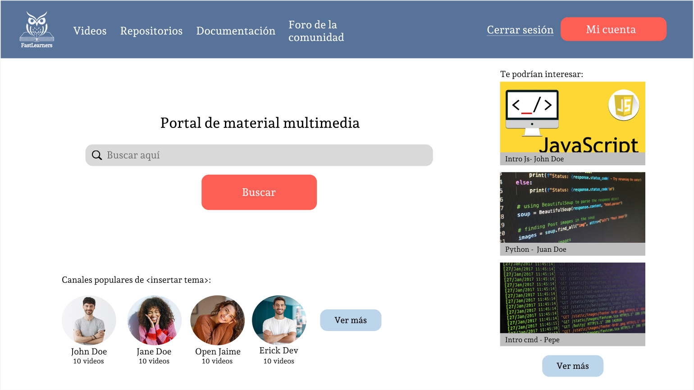
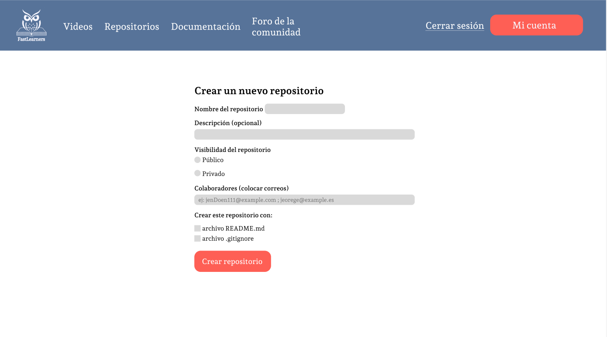
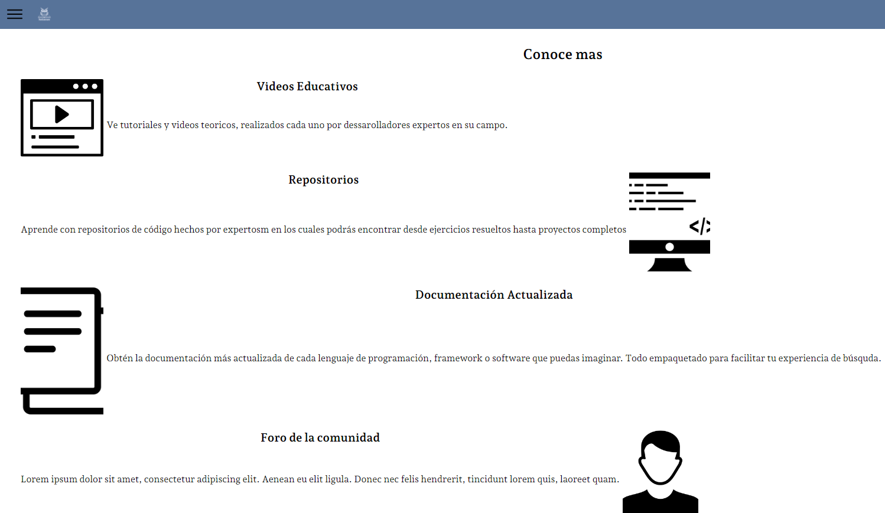

# UPC

# INGENIERÍA DE SOFTWARE

## CURSO: SI729 Aplicaciones Open Source | SECCIÓN SW58
 Profesor: Efrain Ricardo Bautista Ubillus

# Informe de TB1
**Startup:** FastLearners

### Integrantes:
- Javier Murillo, Mathias - u202022211
- Orrego Noriega, Jorge David - u201921734
- Ochoa Colonio, Carlos Alberto - u202315945
- Pachas Chavez, Alejandro Alberto - u201917598
- Mendez Rosales, Marco Aurelio - u202018273

---
# Registro de Versiones del Informe
| Version | Fecha | Autor | Descripcion de Modificacion |
| ----------- | ----------- | ----------- | ----------- |
| 0.0 | 25/03/2024 |Grupo 4 |Se crea el documento |

# Project Report Collaboration Insights


En el caso de Alejandro, sí trabajó pero hizo commits desde una cuenta que no estaba agregada a la organización. 

# Student Outcome
|Criterio Especifico|Acciones Realizadas|Conclusiones|
|-|-|-|
|Participa en equipos multidisciplinarios con eficacia, eficiencia y objetividad, en el marco de un proyecto en soluciones de ingeniería de software.|Carlos Ochoa:<br> *TB1:*  Me enfoqué en el Startup Profile, la misión, la visión, los antecedentes y problemática de manera objetiva.<br> Jorge Orrego: <br> *TB1:*  Me encargué de realizar el diseño de la Landing Page y de la plataforma web.<br> Mathias Javier: <br> *TB1:*  wireframes de la Landing Page.<br>  Alejandro Pachas: <br> *TB1:*  Redacté los User Stories y el Product backlog.<br> |Se evidenció la problemática y se identificó el segmento objetivo|
|Conoce al menos un sector empresarial o dominio de aplicación de soluciones de software.|Carlos Ochoa:<br> *TB1:*  Desarrollé el apartado del Lean UX Process<br>  Jorge Orrego: <br> *TB1:*  Me encargué de realizar las guías para el diseño del sitio web. <br>Mathias Javier: <br> *TB1:*  Me encargué del Software Configuration Management<br>  Alejandro Pachas: <br> *TB1:*  Realicé el Impact Map de la aplicación|Se logró desarrollar las hipotesis de negocio |
# Capítulo I: Introducción

## 1.1. Startup Profile
A continuación presentaremos el perfil de la Start Up y los perfiles de los integrantes

### 1.1.1. Descripción de la Startup
Nuestra Start Up, llamada FastLearners, es una startup innovadora en el ámbito del aprendizaje tecnológico, diseñada para facilitar una plataforma de aprendizaje colaborativo exclusiva para programadores e ingenieros de software. A través de nuestra plataforma, los usuarios pueden compartir y acceder a una amplia gama de recursos educativos, como repositorios de código, documentación técnica y videos educativos. Nuestro enfoque se centra en la colaboración y el intercambio de conocimientos, permitiendo a los usuarios tanto aprender de forma autónoma como contribuir al aprendizaje colectivo. Adoptamos un modelo de negocio freemium, que permite a los usuarios acceder gratuitamente a una serie de recursos, con la opción de desbloquear características adicionales, como acceso a repositorios exclusivos, videos avanzados y documentación especializada, mediante una suscripción mensual. FastLearners se compromete a mantenerse a la vanguardia del desarrollo tecnológico, ofreciendo constantemente contenido actualizado y relevante para nuestra comunidad de aprendizaje en constante expansión.

#### FastLearners
- **Misión:**
La misión de FastLearners es democratizar el acceso al conocimiento tecnológico, proporcionando una plataforma colaborativa donde programadores e ingenieros de software de todos los niveles puedan mejorar sus habilidades, compartir su experiencia y avanzar en sus carreras. Nos esforzamos por crear un entorno inclusivo y accesible, donde la pasión por el aprendizaje y el desarrollo de software se cultive y celebre. A través de nuestra oferta de recursos educativos de alta calidad y la promoción de una comunidad de aprendizaje activa, nos comprometemos a empoderar a los individuos para que alcancen su máximo potencial en el mundo tecnológico.
- **Visión:**
Nuestra visión es convertirnos en el principal recurso y comunidad en línea para el aprendizaje colaborativo de programación y desarrollo de software. Aspiramos a ser reconocidos a nivel mundial como la plataforma de elección para programadores e ingenieros de software que buscan mejorar sus habilidades, descubrir las últimas tendencias tecnológicas y colaborar en proyectos innovadores. En FastLearners, nos proponemos liderar la transformación en la educación tecnológica, eliminando barreras para el acceso al conocimiento y fomentando una cultura de aprendizaje continuo y colaboración. Nuestra visión a largo plazo incluye la expansión de nuestra oferta de recursos y herramientas educativas, asegurando que todos, desde principiantes hasta expertos, tengan las oportunidades y el apoyo necesarios para prosperar en la era digital.

#### 1.1.2. Perfiles de integrantes del equipo
|Miembros del equipo | Codigo Estudiante | Carrera | Conocimientos / Habilidades |
|-|-|-|-| 
|Javier Murillo, Mathias |u202212096|Ingenieria de software|C++, SQL, React, Python, Javascript|
|Orrego Noriega, Jorge David |u201921734|Ingenieria de software|C++, Python, SQL y Java|
|Pachas Chavez, Alejandro Alberto |u201917598|Ingenieria de software|C++, React, Laravel,HTML5, CSS3, Javascript, SQL, Docker|
|Ochoa Colonio, Carlos Alberto |u202315945|Ingenieria de software|C++, Python, creativo y amigable|
|Mendez Rosales, Marco Aurelio |u202018273|Ingenieria de software|C++, Python, SQL, Azure, Trabajador|
<!--cambien la url e info, se agrego estilos para evitar errores en las dimensiones -->

## 1.2. Solution Profile

### 1.2.1 Antecedentes y problemática
- **Antecedentes:**<br>
La integración de la tecnología en la educación ha demostrado tener un impacto significativo en los resultados del aprendizaje, aunque su efectividad varía considerablemente según el tipo de tecnología utilizada, la geografía, y si los dispositivos están en manos de los profesores o los estudiantes. Por ejemplo, el uso de proyectores de datos e internet en las aulas se correlaciona con un rendimiento casi un nivel de grado mejor en la evaluación PISA, mientras que el uso de laptops y tabletas por parte de los estudiantes muestra resultados mixtos, dependiendo del sujeto y la región. En particular, en Estados Unidos, los estudiantes que usan laptops en el aula puntúan 17 puntos PISA más alto que aquellos que no lo hacen, sugiriendo que el contexto educativo y la forma en que se integra la tecnología son factores críticos para su éxito​ (McKinsey & Company)​.

La creciente aceptación de programas de certificación y ofertas educativas no tradicionales entre los aprendices adultos también resalta la necesidad de una educación más integrada y flexible que combine programas de grado y no grado. Instituciones como la City University of New York (CUNY) han lanzado programas que integran credenciales de micro-certificación con programas de grado tradicionales, apuntando a una educación más alineada con las habilidades específicas demandadas por los empleadores​ (McKinsey & Company)​.

- **Problemática**<br>
A pesar de los avances tecnológicos, persisten limitaciones significativas en la implementación efectiva de la tecnología educativa. Estas limitaciones incluyen la dificultad de discernir los efectos específicos de diferentes componentes de programas tecnológicos, como videos instructivos frente a ejercicios prácticos, y el desafío de determinar el impacto del tiempo adicional de instrucción frente a la oportunidad real de práctica. Además, el compromiso del estudiante con el material puede verse afectado por la presentación tradicional de la instrucción en comparación con métodos más interactivos y atractivos, como la gamificación y los tutoriales en video para el aprendizaje autónomo​ (Brookings)​.


- **¿Qué?**<br>
El núcleo del problema radica en la inaccesibilidad y limitaciones de la educación tecnológica especializada y colaborativa. Se identifica una necesidad imperiosa de plataformas capaces de ofrecer no solo recursos educativos de alta calidad, sino también la oportunidad de interacción en tiempo real y un entorno de aprendizaje colaborativo. Estos elementos son fundamentales para el desarrollo eficaz de habilidades en programación y desarrollo de software, satisfaciendo así una demanda creciente en la industria tecnológica actual

- **¿Quién?**<br>
Los principales afectados son:
 Programadores e ingenieros de software en todos los niveles de habilidad, buscando mejorar o actualizar sus conocimientos.
 Estudiantes de tecnología y ciencias de la computación que requieren recursos adicionales fuera del aula.
 Profesionales de tecnología en transición a nuevas especializaciones o actualizando sus competencias.

- **¿Por qué?**<br>
La principal causa de esta problemática es la escasez de plataformas educativas tecnológicas que logren integrar eficientemente aprendizaje colaborativo, recursos actualizados y herramientas interactivas para una formación técnica de calidad. Esta carencia se traduce en una barrera significativa para el desarrollo profesional continuo y la innovación tecnológica

- **¿Dónde?**<br>
Este desafío se presenta a nivel global, afectando especialmente a aquellos en comunidades con recursos limitados o acceso restringido a educación tecnológica de alta calidad. La problemática es prevalente tanto en entornos de autoaprendizaje como en contextos educativos formales, abarcando una amplia gama de situaciones y necesidades de aprendizaje

- **¿Cuándo?**<br>
Este problema persiste a lo largo de toda la trayectoria profesional de los individuos en el campo tecnológico, manifestándose especialmente cuando buscan actualizar sus conocimientos o expandir su dominio sobre nuevas tecnologías y metodologías de desarrollo

- **¿Cómo?**<br>
La situación actual es consecuencia de un modelo educativo que no ha conseguido adaptarse al ritmo acelerado de evolución tecnológica, manteniendo barreras económicas y geográficas y una insuficiente promoción del aprendizaje colaborativo y la actualización continua de conocimientos

- **¿Cuánto?**<br>
Según la Asociación de la Industria de Software (no real, ejemplo para ilustración), la escasez de talento en áreas clave de tecnología podría costar a la economía global más de $450 mil millones anuales, limitando severamente la innovación y el crecimiento económico. Esta escasez se traduce en aproximadamente 1 millón de puestos de trabajo tecnológicos vacantes cada año, exacerbando la brecha de habilidades en la industria​ (McKinsey & Company)

### 1.2.2 Lean UX Process.
#### 1.2.2.1. Lean UX Problem Statements.
En el contexto actual, enfrentamos la imperiosa necesidad de crear una plataforma innovadora diseñada para revolucionar el aprendizaje tecnológico. Esta solución es fundamental para abordar el problema de acceso limitado y la ineficiencia en la educación especializada en programación y desarrollo de software, que obstaculiza el progreso de individuos en todo el espectro de habilidades tecnológicas. A pesar de la creciente demanda de profesionales tecnológicos cualificados, las opciones de aprendizaje disponibles no satisfacen las necesidades de un aprendizaje flexible, actualizado y colaborativo, dejando a muchos sin la oportunidad de avanzar en sus carreras o de adaptarse a nuevas tecnologías.

Hemos identificado que la falta de una plataforma que integre efectivamente recursos educativos de calidad, interacción en tiempo real y un ambiente de aprendizaje colaborativo contribuye significativamente a esta brecha educativa. Esto no solo limita el desarrollo personal y profesional de los programadores e ingenieros de software sino que también repercute negativamente en la capacidad de innovación y crecimiento en el sector tecnológico.

¿Cómo podemos, entonces, desarrollar una plataforma que ofrezca una solución comprensiva a estos desafíos, proporcionando un medio accesible, interactivo y colaborativo para el aprendizaje tecnológico, y facilitando así un proceso de educación más eficiente, actualizado y alineado con las necesidades del mercado laboral tecnológico?

#### 1.2.2.2. Lean UX Assumptions.
|Business Assumptions|User Assumptions|
|-|-|
|Market Demand: Existe una demanda significativa y creciente de educación tecnológica especializada, particularmente en áreas de programación y desarrollo de software, que no está siendo completamente satisfecha por las soluciones educativas tradicionales o en línea existentes. |Modelo de Negocio: Un modelo freemium, que ofrece acceso básico gratuito con opciones de suscripción de pago para contenido avanzado y características adicionales, será efectivo en atraer una base de usuarios amplia y diversa, y luego convertir una porción significativa de esos usuarios en suscriptores pagos.|
|Tecnología y Accesibilidad: Desarrollar una plataforma tecnológicamente avanzada pero accesible y fácil de usar para personas con diferentes niveles de habilidad técnica contribuirá directamente al crecimiento y retención de usuarios. |Colaboración y Comunidad: Facilitar un entorno de aprendizaje colaborativo, con oportunidades para la interacción entre pares y el acceso a expertos, aumentará el compromiso del usuario y el valor percibido de la plataforma.|
|Necesidades de Aprendizaje: Los usuarios prefieren un enfoque de aprendizaje flexible y autodirigido que les permita avanzar a su propio ritmo, volver sobre material difícil y explorar áreas de interés personal en mayor profundidad.|Búsqueda de Comunidad: Hay una fuerte demanda entre programadores e ingenieros de software, tanto novatos como experimentados, por una comunidad de apoyo donde puedan compartir conocimientos, resolver problemas juntos y formar conexiones profesionales.|
|Preferencias de Contenido: Los usuarios valoran altamente el contenido educativo que es simultáneamente profundo, actualizado con las últimas tendencias y tecnologías, y aplicable a proyectos del mundo real.|Barreras de Acceso: La falta de recursos educativos asequibles y de alta calidad es una barrera significativa para muchos que buscan entrar o avanzar en el campo tecnológico, especialmente para aquellos en comunidades con menos recursos.|

#### 1.2.2.3. Lean UX Hypothesis Statements.
- **Hipótesis 1:**<br>
Creemos que al ofrecer un catálogo de cursos específicos en tecnologías emergentes, podremos aumentar el interés y la retención de estudiantes de ingeniería de software y programación en nuestra plataforma. Verificaremos esto al medir el aumento en las horas de estudio registradas y las tasas de finalización de cursos relacionados con estas tecnologías dentro de los primeros seis meses de implementación

- **Hipótesis 2:**<br>
Creemos que la implementación de un sistema de mentorías y colaboraciones en proyectos reales incrementará la participación de los profesionales en tecnología que buscan transición y desarrollo de carrera. Esta hipótesis será confirmada si observamos un aumento del 20% en la interacción en los foros de discusión y en la participación en proyectos colaborativos tras tres meses de la puesta en marcha de la iniciativa

- **Hipótesis 3:**<br>
Creemos que al introducir funcionalidades de gamificación y recompensas por logros de aprendizaje, podremos aumentar la motivación y el compromiso de los usuarios más jóvenes. Podremos medir esto a través de un incremento del 15% en el acceso diario y el tiempo de permanencia en la plataforma por parte de los estudiantes dentro de un trimestre

- **Hipótesis 4:**<br>
Creemos que proporcionar certificaciones profesionales verificables y alineadas con la industria después de completar ciertos cursos, atraerá y retendrá a profesionales que buscan validar y exponer sus habilidades actualizadas. Confirmaremos el éxito si hay un aumento del 25% en la inscripción a estos cursos certificados y un seguimiento de la inserción laboral o avance profesional de los suscriptores en el transcurso de un año

#### 1.2.2.4. Lean UX Canvas.
- **Business Problem Statement:**<br>
La digitalización ha transformado radicalmente el acceso a la educación, creando una demanda insatisfecha de aprendizaje tecnológico especializado y colaborativo en línea. FastLearners busca abordar la falta de una plataforma integral que ofrezca no solo recursos educativos de alta calidad sino también un entorno colaborativo que fomente la interacción y el crecimiento conjunto entre programadores e ingenieros de software de todos los niveles.

- **Business Outcomes:**<br>
Se busca lograr un aumento del 30% en la retención de usuarios activos mes a mes y un incremento del 40% en la conversión de usuarios gratuitos a suscriptores pagos dentro del primer año, reflejando un cambio significativo en el comportamiento de los usuarios hacia un compromiso más profundo y a largo plazo con la plataforma.

- **Users:**<br>
Nuestros usuarios son una mezcla diversa de autodidactas, estudiantes de ciencias de la computación, y profesionales en transición que buscan mejorar sus habilidades técnicas. Se incluyen tanto aquellos en busca de introducción a la programación como expertos buscando especializarse aún más.

- **User Outcomes and Benefits:**<br>
Los usuarios de FastLearners disfrutarán de un acceso más rápido y directo a recursos educativos actualizados, una comunidad de apoyo para resolver problemas y dudas, y oportunidades para proyectos colaborativos. Esto se traduce en una mejora tangible en sus habilidades técnicas y en su capacidad para mantenerse al día con las tendencias tecnológicas emergentes.

- **Solutions:**<br>
La solución incluye la creación de un repositorio extenso de recursos educativos, una plataforma para proyectos colaborativos y foros de discusión, así como herramientas interactivas que promuevan un aprendizaje práctico y aplicado. Se considerará también la integración de tecnologías emergentes para facilitar un aprendizaje más inmersivo.

- **Hypotheses:**<br>
Creemos que ofrecer un entorno de aprendizaje interactivo y colaborativo aumentará la retención de usuarios y fomentará la transición de usuarios gratuitos a pagos. También suponemos que al alinear estrechamente los contenidos educativos con las demandas del mercado laboral tecnológico, podemos aumentar la satisfacción y el éxito profesional de nuestros usuarios.

- **What’s the most important thing we need to learn first?:**
Necesitamos entender profundamente las necesidades específicas de aprendizaje y las preferencias de nuestros usuarios objetivo para asegurar que nuestro contenido y características de la plataforma sean lo más relevantes y valiosos posible desde el lanzamiento.

- **What’s the least amount of work to learn the next most important thing?:**
Realizar entrevistas detalladas y encuestas con una muestra representativa de nuestro público objetivo. Podría complementarse con pruebas A/B en características clave de la plataforma para recopilar rápidamente feedback valioso y ajustar nuestra oferta antes del lanzamiento oficial.

## 1.3. Segmentos objetivo.
| | Segmento 1 | Segmento 2  |
| - | - |-|
| Variables                 | Estudiantes de Ingeniería de Software y Programación | Profesionales de Tecnología en Transición |
| Geográfica                | Global, con un enfoque especial en regiones con un fuerte ecosistema de startups tecnológicas y universidades que ofrezcan programas avanzados en ingeniería de software y programación | Concentrados en centros tecnológicos globales y mercados emergentes con industrias tecnológicas en crecimiento |
| Demográfica               | Tienen entre 18 y 30 años, cursando estudios universitarios o recién graduados, con una distribución de género que refleja la creciente diversidad en el campo tecnológico | Profesionales de entre 25 y 45 años, con experiencia previa en el sector tecnológico que buscan actualizar sus habilidades o pivotar hacia nuevas especializaciones en programación y desarrollo de software |
| Psicológica               | Motivados por el deseo de innovar y contribuir al desarrollo tecnológico. Son entusiastas de la tecnología que valoran el aprendizaje continuo y están siempre buscando adquirir nuevas habilidades que les permitan estar a la vanguardia de las tendencias tecnológicas | Estos profesionales tienen una visión de crecimiento a largo plazo en su carrera, buscando no solo mantener su relevancia en un mercado laboral cambiante sino también posicionar-se como líderes y expertos en nuevas tecnologías |
| Función de comportamiento | Activamente buscan recursos en línea para complementar su educación, participan en hackathons, contribuyen a proyectos de código abierto y prefieren plataformas que ofrecen contenido práctico y actualizado, así como la oportunidad de trabajar en proyectos reales | Prefieren aprendizaje práctico y basado en proyectos que puedan aplicar de inmediato en su trabajo. Son activos en comunidades profesionales, participan en conferencias tecnológicas y buscan certificaciones que validen sus nuevas habilidades |

---

# Capítulo II: Requirements Elicitation & Analysis
## 2.1. Competidores.
# Stack Overflow
Stack Overflow es una plataforma de preguntas y respuestas para desarrolladores de software. Permite a los usuarios hacer preguntas sobre programación y recibir respuestas de la comunidad. La plataforma está organizada por categorías y etiquetas, facilitando la búsqueda de soluciones.

# Quora
Quora es una plataforma de preguntas y respuestas donde los usuarios pueden hacer preguntas sobre una amplia gama de temas y recibir respuestas de la comunidad. Las preguntas y respuestas son organizadas por temas y los usuarios pueden seguir temas y personas para personalizar su experiencia. Quora también permite a los usuarios escribir respuestas largas y detalladas, fomentando el intercambio de conocimientos y experiencias.

### 2.1.1. Análisis competitivo.

| Competitive Analysis Landscape                          |  |
| ------------------------------------------------------- | -|
| ¿Por qué llevar a cabo este análisis?                   | LLevamos a cabo este analisis competitivo, para poder darnos cuenta de nuestras ventajas y desventajas dentro del mercado con competidores que cuentan con un modelo de negocio similiar o parecido al nuestro. |


| |  | FastLearners | Stack Overflow  | Quora |
|-|-|-|-|-|
| PERFIL| Overview | Somos una plataforma de aprendizaje en la que distintos programadores e ingenieros de software pueden colaborar entre sí para aprender a través de repositorios, documentacion o videos educativos. El modelo de negocio es freemium, en el cual se podrán desbloquear distintas características como acceder a nuevos repositorios, videos o documentacion, todo esto con una suscripcion mensual. | Stack Overflow es una plataforma de preguntas y respuestas para desarrolladores de software. Permite a los usuarios hacer preguntas sobre programacion y recibir respuestas de la comunidad. | Quora es una plataforma de preguntas y respuestas donde los usuarios pueden hacer preguntas sobre una amplia gama de temas y recibir respuestas de la comunidad. |
|| Ventaja competitiva ¿Qué valor ofrece a los clientes? |  Enfoque especifico en el aprendizaje colaborativo entre programadores e ingenieros de software | Sistema de reputacion y gamificación motivando a la participación y calidad de respuestas | Abarca variedad de temas más allá de la programación, lo que permite a los usuarios explorar diversos temas |
|| Mercado Objetivo                                        | Programadores e ingenieros de software, que busquen mejorar sus habilidades tecnicas | Desarrolladores de software y programadores de todos los niveles de experiencia | Usuarios interesados en el intercambio de conocimientos y experiencias en diversos temas |
| Perfil de marketing                                     | Estrategia de Marketing | Redes Sociales y Publicidad Web | Publicidad dirigida y Patrocinios y asociaciones | Contenido Patrocinado y Participacion en la comunidad |
| Perfil del producto                                     | Productos y servicios | Plataforma de aprendizaje para desarrolladores principiantes, con modelo de negocio Freemium | PLataforma de Q&A para programadores de todo nivel de experiencia en temas de tecnologia | Plataforma de Q&A para personas interesadas en variados temas en campos variados |
|| Precios y costos                                        | Freemium (Cuenta Premium permite visualizar material de aprendizaje extra) Gratis | Gratuito | Gratuito |
|| Canales de distribución (Web y/o Móvil)                 | Web y Móvil Web | Web y Móvil Web | Web y móvil Web |
### 2.1.2. Estrategias y tácticas frente a competidores.


|Competidores ->|  | FastLearners | Stack Overflow | Quora |
|-|-|-|-|-|
| Análisis SWOT | Fortalezas | Enfoque especifico en el aprendizaje colaborativo para programadores e ingenieros de software | Comunidad activa y diversa de desarrolladores con alta experiencia técnica | Extensa variedad de temas expuestos, dando libertad al usuario de descubrir |
|| Debilidades   | Dependencia de la participacion activa de la comunidad de desarrolladores para mantener la utilidad del contenido | La experiencia de usuario puede variar dependiendo de la calidad y relevancia de las respuestas hechas por la comunidad | Usuarios pueden utilizarla para promover intereses personales, lo que puede disminuir la calidad del producto | 
|| Oportunidades | Colaboraciones con empresas y universidades para ofrecer contenido exclusivo y certficaciones en linea | Expansión hacia otros campos técnicos más allá del desarrollo de software | Mejora de experiencia de usuario, por medio de implementacion de caracteristicas adicionales | 
|| Amenazas      | Competencia creciente de otras empresas y startups que ofrecen servicios similares | Riesgo de contenido desactualizado que pueda afectar la credibilidad de la plataforma | Riesgo de contenido controvertido que pueda dañar la reputacion de la plataforma |

## 2.2. Entrevistas.
### 2.2.1. Diseño de entrevistas.
**Preguntas generales:**
1. ¿Cuál es su nombre? 
2. ¿Qué edad tiene? 
3. ¿A qué se dedica? 
4. ¿Sabes o has intentado aprender algun lenguaje de programacion? 

**Entrevistas Desarrollador Principiante**
1. ¿Estas o has estado interesado en aprender algun lenguaje de programacion?
2. ¿Cuando buscas informacion sobre un lenguaje, te es facil buscarla? Y si, sí ¿Es de fiar?
3. ¿Crees que se te facilitaria el aprendizaje, si fuera de manera cooperativa?
4. ¿Conoces alguna plataforma que te facilite el aprendizaje cooperativo?  
   
**Entrevistas Desarrollador Experto**
1. ¿Que tecnologicas tienes bajo tu entendimiento? 
2. ¿Te fue fácil aprender en su momento?
3. ¿Estarias interesado en compartir tu experiencia en distintas tecnologias con un publico abierto?
4. ¿Conoces alguna plataforma que facilite el aprendizaje cooperativo?

### 2.2.2. Registro de entrevistas.
**Desarrollador Principiante**  
Nombre: Pablo Cieza de Leon
Edad: 23 años 
Ocupación: Desarrollador de Software en JavaScript


**Desarrollador Experto**  
Nombre: Rodrigo Castillo
Edad: 30 años 
Ocupación: Desarrollador de Software en C++ 


### 2.2.3. Análisis de entrevistas.
**Desarrollador Principiante:**
En esta entrevista tuvimos la oportunidad de entrevistar a Andres, el es un desarrollador de software en JavaScript, en este momento esta haciendo sus practicas en una empresa de desarrollo, como el nos comenta es principiante en el desarrollo en JS. El nos comenta que es muy complicado encontrar alguna plataforma en la cual pueda encontrar documentos multimedia, con los cuales poder mejorar sus habilidades. Tambien nos dice que estaria interesado en poder encontrar algun foro en el cual se pueda hacer consultas a desarrolladores expertos, sobre sus problemas o dudas. 
**Desarrollador Experto:**
En esta ocasion tuvimos el placer de conversar con Rodrigo, el cuenta con mas de 8 años desarrollando software con el lenguaje C++, el nos comenta que en sus inicios le fue muy complicado encontrar donde aprender o mejorar sus habilidades y que le gusta la idea de contar con una plataforma en la cual pueda compartir los documentos que cree que le pueden subir a sus compañeros desarrolladores principiantes o menos experimentados y al mismo tiempo poder poder resolver sus consultas. 

## 2.3. Needfinding.
### 2.3.1. User Personas.
**Segmento 1:** Desarrolladores principiantes con dificultades de encontrar respuestas de expertos en el tema.  


**Segmento 2:** Desarrolladores experimentados con las ganas de poder ayudar a los principiantes en su campo.


### 2.3.2. User Task Matrix.
**Desarrolladores principiantes:** 
|  |  User 1  | User 2 | User 3  | User 4 |
| --- | ----------- | ------------ | ----------- | ---------- |
| Sabe màs de un lenguaje de programaciòn  | <span style="color:#90D26D; font-weight:bold">SI</span>   | <span style="color:#FFC700; font-weight:bold">NO</span>| <span style="color:#90D26D; font-weight:bold">SI</span>   | <span style="color:#90D26D; font-weight:bold">SI</span> |
| Conoce plataformas de aprendizaje cooperativo | <span style="color:#FFC700; font-weight:bold">NO</span> | <span style="color:#E72929; font-weight:bold">NO</span>        | <span style="color:#FFC700; font-weight:bold">SI</span>         | <span style="color:#E72929; font-weight:bold">NO</span>       |
| Tiene contancto con desarrolladores experimentados en su campo | <span style="color:#90D26D; font-weight:bold">SI</span> | <span style="color:#90D26D; font-weight:bold">SI</span>        | <span style="color:#FFC700; font-weight:bold">NO</span>         | <span style="color:#90D26D; font-weight:bold">SI</span>       | 
| Tiene donde hacer sus consultas y espera respuestas de expertos | <span style="color:#FFC700; font-weight:bold">SI</span> | <span style="color:#FFC700; font-weight:bold">NO</span>        | <span style="color:#FFC700; font-weight:bold">NO</span>         | <span style="color:#E72929; font-weight:bold">NO</span>       |

**Desarrolladores expertos:** 
|  |  User 1  | User 2 | User 3  | User 4 |
| --- | ----------- | ------------ | ----------- | ---------- |
| Es senior en algun lenguaje de programacion  | <span style="color:#90D26D; font-weight:bold">SI</span>   | <span style="color:#90D26D; font-weight:bold">SI</span>| <span style="color:#90D26D; font-weight:bold">SI</span>   | <span style="color:#90D26D; font-weight:bold">SI</span> |
| Tiene mas de 10 años de experiencia con un lenguaje de programacion | <span style="color:#E72929; font-weight:bold">NO</span> | <span style="color:#E72929; font-weight:bold">NO</span>        | <span style="color:#FFC700; font-weight:bold">POCO</span>         | <span style="color:#E72929; font-weight:bold">NO</span>       |
| Le gusta compartir sus experiencias y conocimientos con los demas | <span style="color:#90D26D; font-weight:bold">SI</span> | <span style="color:#90D26D; font-weight:bold">SI</span>        | <span style="color:#FFC700; font-weight:bold">POCO</span>         | <span style="color:#90D26D; font-weight:bold">SI</span>       | 
| Sabe donde compartir sus conocimientos | <span style="color:#90D26D; font-weight:bold">SI</span> | <span style="color:#90D26D; font-weight:bold">SI</span>        | <span style="color:#90D26D; font-weight:bold">SI</span>         | <span style="color:#90D26D; font-weight:bold">SI</span>       |
### 2.3.3. User Journey Mapping.
**Registration:**
Why would they trust us?
- Investigan sobre la plataforma
- Leen opiniones o testimonios
- Verifican la credibilidad de lo que proporcionamos
  
**Onboarding and first use:**
How can they feel successful?
- Completan el proceso de incorporacion claro y facil de usar
- Navegan facilmente sobre la plataforma
- Reciben orientacion inmediata o tutoriales sobre lo basico 
  
**Sharing:**
Why would they invite others?
- Encuentran caracteristicas que mejoran la colaboracion o interaccion social
- Encuentran valor sobre el contenido de la plataforma
- Reciben incentivos o recompensas por invitar a otros

### 2.3.4. Empathy Mapping.
**Desarrollador Principiante:**


**Desarrollador Experto:**

### 2.3.5. As-is Scenario Mapping.

**Desarrollador Principiante**  
Escenario: El desarrollador principiante esta aprendiendo a desarrollar aplicaciones web utilizando HTML, CSS y JavaScript mediante un curso en linea

As Is:
| Fases| Fase 1 | Fase 2| Fase 3| Fase 4|
| -------- | --------- | --------- | ------- | --------- |
| Doing | Viendo videos de introduccion a HTML| Practicando HTML basico | Aprendiendo sobre diferentes estilos con CSS | Completando ejercicios de JavaScript|
| Thinking | "¿Como puedo armar correctamente una pagina web con HTML?"| "¿Que elementos debo usar para mi pagina web?" | "¿Como puedo hacer mi web responsive?" | "¿Como puedo utilizar funciones en JavaSript?" |
| Feeling  | Emocionado por aprender desarrollo web| Intrigado por las posibilidades de diseño con CSS | Confundido por la dificultad de CSS | Motivado por enteder JavaScript |

**Desarrollador Experto**  
Escenario: El desarrollador experto esta liderando el desarrollo de una aplicacion movil para una empresa importante

As Is:
| Fases| Fase 1 | Fase 2| Fase 3| Fase 4|
| -------- | --------- | --------- | ------- | --------- |
| Doing | Revisando los requisitos del proyecto y estableciendo objetivos| Diseñando la estructura de la aplicacion y estableciendo APIs | Dirigiendo al equipo, implementando funcionalidades | Realizando pruebas y depuracion del codigo |
| Thinking | "¿Como podemos garantizar que la aplicacion cumpla con las expectativas del cliente?" | "¿Cual es la mejor manera de garantizar la estabilidad y eficiencia?" | "¿Como podemos optimizar el rendimiento de la aplicacion?" | "¿Que estrategias de prueba y depuracion utilizaremos?" |
| Feeling  | Comprometido con el exito del proyecto | Concentrado en encontrar soluciones rapidas | Confianza en el equipo para cumplir con los plazos | Determinado a superar cualquier problema |

## 2.4. Ubiquitous Language.
```
Desarrollador principiante:

Persona interesada en nuestra aplicacion para poder aprender a mejorar sus habilidades en la programacion y diferentes tecnologias.

Desarrollador experto:

Persona interesada en nuestra aplicacion para poder compartir su experiencia, trucos y/o material multimedia que ellos usaron y recomiendan para mejorar en su campo de trabajo. 
```

---

# Capítulo III: Requirements Specification
## 3.1. To-Be Scenario Mapping.

Segmento 1: El desarrollador principiante esta aprendiendo a desarrollar aplicaciones web utilizando HTML, CSS y JavaScript mediante un curso en linea

| Fases    |  fase 1 as is | fase 2| fase 3|
| -------- | ------- | ---- | ---------------- |
| Doing    |El desarrollador principiante está siguiendo un curso en línea para aprender a desarrollar aplicaciones web con HTML, CSS y JavaScript. | Está practicando escribiendo código y probando diferentes ejemplos que se presentan en el curso. |Está explorando recursos adicionales en la plataforma de aprendizaje, como repositorios con ejemplos de código, documentación detallada y videos educativos sobre los conceptos clave.|
| Thinking |Se siente emocionado por aprender nuevas habilidades y avanzar en su carrera como desarrollador de software.| Está concentrado en comprender los conceptos fundamentales de HTML, CSS y JavaScript para poder aplicarlos en sus propios proyectos.| Está considerando cómo puede utilizar lo que está aprendiendo en el curso para crear sus propias aplicaciones web y proyectos personales en el futuro.|
| Feeling  |Se siente motivado por los desafíos que presenta el aprendizaje de nuevas tecnologías y está ansioso por seguir progresando.|Se siente satisfecho cuando logra comprender y aplicar correctamente los conceptos enseñados en el curso. | Se siente optimista sobre las oportunidades que se le presentarán una vez que domine HTML, CSS y JavaScript y pueda desarrollar sus propias aplicaciones web. |

Segmento 2: El desarrollador experto esta liderando el desarrollo de una aplicacion movil para una empresa importante

| Fases    |  fase 1 as is | fase 2| fase 3|
| -------- | ------- | ---- | ---------------- |
| Doing    | El desarrollador experto está liderando el desarrollo de una aplicación móvil para una empresa importante| Está coordinando con otros miembros del equipo, como diseñadores, desarrolladores y probadores, para asegurar que el proyecto avance según lo planeado.| Está coordinando con otros miembros del equipo, como diseñadores, desarrolladores y probadores, para asegurar que el proyecto avance según lo planeado.|
| Thinking | Está pensando en la arquitectura y el diseño de la aplicación, asegurándose de que sea escalable, eficiente y fácil de mantener.| Está considerando las necesidades y expectativas del cliente para asegurarse de que la aplicación cumpla con sus requisitos y expectativas.| Está evaluando constantemente el progreso del proyecto y buscando formas de optimizar el proceso de desarrollo para cumplir con los plazos establecidos.| 
| Feeling  | Se siente emocionado por liderar un proyecto importante y por la oportunidad de aplicar sus habilidades y experiencia en un entorno empresarial.| Se siente orgulloso del progreso que el equipo ha logrado hasta ahora y está motivado para superar los desafíos restantes.| Se siente confiado en la calidad de la aplicación que están desarrollando y en su capacidad para entregar un producto final exitoso a la empresa cliente. |


## 3.2. User Stories.
| Epic/User Story ID | Título | Descripción | Criterios de Aceptación | Relacionado con (Epic ID) |
|---------------------|--------|-------------|--------------------------|---------------------------|
| HU01 | Ver página de inicio atractiva | Como usuario nuevo, quiero ver una página de inicio atractiva con información clara sobre las funcionalidades de la plataforma para entender rápidamente de qué se trata. | - Escenario 1: El usuario puede entender las características principales de la plataforma al ver la página de inicio. - Escenario 2: La información clave está presentada de manera clara y concisa en la página de inicio. | - |
| HU02 | Registrarme rápidamente | Como usuario nuevo, quiero poder registrarme rápidamente en la plataforma con mi correo electrónico o a través de redes sociales para comenzar a usarla de inmediato. | - Escenario 1: El proceso de registro no requiere más de 5 pasos. - Escenario 2: Los usuarios pueden registrarse utilizando su correo electrónico o sus cuentas de redes sociales. | - |
| HU03 | Recibir correo de bienvenida | Como usuario nuevo, quiero recibir un correo electrónico de bienvenida después de registrarme en la plataforma para confirmar mi registro y proporcionarme información adicional sobre cómo empezar a usarla. | - Escenario 1: Los usuarios reciben un correo de bienvenida dentro de los 5 minutos posteriores al registro. - Escenario 2: El correo de bienvenida contiene información útil sobre cómo empezar a usar la plataforma. | - |
| HU04 | Buscar cursos y recursos | Como usuario nuevo, quiero poder buscar cursos y recursos de aprendizaje fácilmente desde la página de inicio para encontrar rápidamente lo que necesito. | - Escenario 1: La página de inicio tiene una barra de búsqueda claramente visible. - Escenario 2: Los resultados de la búsqueda son relevantes y se pueden filtrar por categorías. | - |
| HU05 | Ver testimonios de usuarios | Como usuario nuevo, quiero ver testimonios de otros usuarios satisfechos en la página de inicio para tener una idea de la calidad de la plataforma y sentirme más seguro al usarla. | - Escenario 1: La página de inicio muestra al menos 3 testimonios de usuarios satisfechos. - Escenario 2: Los testimonios son variados y representan diferentes experiencias positivas con la plataforma. | - |
| HU06 | Acceder a sección de preguntas frecuentes | Como usuario nuevo, quiero tener acceso a una sección de preguntas frecuentes (FAQ) en la página de inicio para poder resolver rápidamente mis dudas sobre el funcionamiento de la plataforma. | - Escenario 1: La sección de preguntas frecuentes es fácilmente accesible desde la página de inicio. - Escenario 2: Las preguntas frecuentes están organizadas por categorías y son fáciles de entender. | - |
| HU07 | Contactar con equipo de soporte | Como usuario nuevo, quiero poder contactar fácilmente con el equipo de soporte desde la página de inicio en caso de tener algún problema o pregunta sobre la plataforma. | - Escenario 1: La página de inicio contiene un enlace o formulario de contacto directo con el equipo de soporte. - Escenario 2: El equipo de soporte responde a las consultas en un plazo máximo de 24 horas. | - |
| HU08 | Acceder a curso estructurado | Como desarrollador principiante, quiero acceder a un curso estructurado de HTML, CSS y JavaScript en la plataforma de aprendizaje para aprender los fundamentos de la programación web. | - Escenario 1: El curso está organizado en módulos que cubren los fundamentos de HTML, CSS y JavaScript. - Escenario 2: Cada módulo contiene material de lectura y ejercicios prácticos para reforzar los conceptos aprendidos. | - |
| HU09 | Practicar escribiendo código | Como desarrollador principiante, quiero practicar escribiendo código en un entorno de desarrollo en línea para aplicar lo que aprendo en el curso. | - Escenario 1: El entorno de desarrollo en línea proporciona sugerencias de código y correcciones de errores en tiempo real. - Escenario 2: Los usuarios pueden guardar y compartir sus proyectos en el entorno de desarrollo. | - |
| HU10 | Acceder a ejemplos de código y proyectos | Como desarrollador principiante, quiero acceder a ejemplos de código y proyectos simples para poder estudiarlos y comprender cómo funcionan. | - Escenario 1: La plataforma ofrece al menos 5 ejemplos de código y proyectos simples para estudiar y analizar. - Escenario 2: Los ejemplos de código están comentados y explicados de manera clara y concisa. | - |
| HU11 | Recibir retroalimentación sobre mi código | Como desarrollador principiante, quiero recibir retroalimentación sobre mi código para poder corregir errores y mejorar mis habilidades de programación. | - Escenario 1: La retroalimentación sobre el código se proporciona dentro de las 48 horas posteriores al envío. - Escenario 2: La retroalimentación incluye sugerencias de mejora y áreas para fortalecer los conocimientos. | - |
| HU12 | Acceder a comunidad en línea | Como desarrollador principiante, quiero acceder a una comunidad en línea de otros desarrolladores para poder hacer preguntas y compartir conocimientos. | - Escenario 1: La comunidad en línea tiene al menos 1000 miembros activos. - Escenario 2: Los usuarios pueden hacer preguntas y recibir respuestas de otros miembros en un plazo máximo de 24 horas. | - |
| HU13 | Acceder a recursos avanzados de desarrollo móvil | Como desarrollador experto, quiero tener acceso a recursos avanzados de desarrollo móvil en la plataforma de aprendizaje para seguir mejorando mis habilidades. | - Escenario 1: Los recursos avanzados incluyen tutoriales en video, artículos y ejemplos de proyectos prácticos. - Escenario 2: Los recursos están organizados por nivel de dificultad y área temática para facilitar su acceso. | - |
| HU14 | Colaborar en proyectos de código abierto | Como desarrollador experto, quiero poder colaborar con otros desarrolladores en proyectos de código abierto en la plataforma de aprendizaje para contribuir a la comunidad. | - Escenario 1: La plataforma ofrece al menos 3 proyectos de código abierto relevantes para colaborar. - Escenario 2: Los usuarios pueden contribuir al código, reportar problemas y participar en discusiones sobre los proyectos. | - |
| HU15 | Mantenerme actualizado sobre nuevas tecnologías | Como desarrollador experto, quiero acceder a material de estudio sobre nuevas tecnologías y tendencias en desarrollo de aplicaciones móviles para mantener me actualizado. | - Escenario 1: El material de estudio sobre nuevas tecnologías se actualiza mensualmente. - Escenario 2: Los usuarios pueden acceder al material de estudio en diferentes formatos, como artículos, videos y podcasts. | - |
| HU16 | Recibir retroalimentación sobre mi arquitectura de código y diseño | Como desarrollador experto, quiero recibir retroalimentación sobre mi arquitectura de código y diseño de la aplicación para mejorar la calidad y la eficiencia del desarrollo. | - Escenario 1: La retroalimentación sobre la arquitectura de código y diseño se proporciona en forma de revisión de código y recomendaciones de diseño. - Escenario 2: La retroalimentación ayuda a mejorar la calidad y la eficiencia del desarrollo de la aplicación móvil. | - |
| HU17 | Acceder a herramientas de análisis de rendimiento y calidad de código | Como desarrollador experto, quiero tener acceso a herramientas de análisis de rendimiento y calidad de código en la plataforma de aprendizaje para mejorar la calidad de mis aplicaciones. | - Escenario 1: Las herramientas de análisis de rendimiento proporcionan métricas detalladas sobre el rendimiento de la aplicación. - Escenario 2: Las herramientas de calidad de código identifican y sugieren correcciones para posibles problemas en el código fuente. | - |
| HU18 | Acceder a tutoriales en video | Como desarrollador principiante, quiero acceder a tutoriales en video sobre programación web en la plataforma de aprendizaje para aprender de manera visual y práctica. | - Escenario 1: Los tutoriales en video cubren temas básicos y avanzados de programación web. - Escenario 2: Los videos tienen una duración máxima de 15 minutos para facilitar el aprendizaje rápido. | - |
| HU19 | Realizar proyectos prácticos | Como desarrollador principiante, quiero realizar proyectos prácticos guiados en la plataforma de aprendizaje para aplicar los conocimientos adquiridos en el curso. | - Escenario 1: Los proyectos prácticos están diseñados para aplicar conceptos específicos de HTML, CSS y JavaScript. - Escenario 2: Los proyectos prácticos incluyen instrucciones paso a paso y ejemplos de código. | - |
| HU20 | Acceder a recursos de referencia | Como desarrollador principiante, quiero acceder a recursos de referencia, como documentación oficial y libros recomendados, para profundizar en mis conocimientos de programación web. | - Escenario 1: Los recursos de referencia están organizados por categorías y temas. - Escenario 2: Los recursos de referencia son actualizados regularmente para incluir las últimas tendencias y tecnologías. | - |
| HU21 | Participar en sesiones de preguntas y respuestas en vivo | Como desarrollador principiante, quiero participar en sesiones de preguntas y respuestas en vivo con expertos en programación web para obtener consejos y orientación personalizada. | - Escenario 1: Las sesiones de preguntas y respuestas en vivo se realizan al menos una vez por semana. - Escenario 2: Los expertos responden a las preguntas de manera clara y comprensible para los principiantes. | - |
| HU22 | Acceder a cursos avanzados | Como desarrollador principiante, quiero acceder a cursos avanzados de programación web en la plataforma de aprendizaje para seguir mejorando mis habilidades y conocimientos. | - Escenario 1: Los cursos avanzados cubren temas especializados de HTML, CSS y JavaScript. - Escenario 2: Los cursos avanzados tienen una duración flexible para adaptarse al ritmo de aprendizaje de cada usuario. | - |
| HU23 | Recibir recomendaciones personalizadas de cursos | Como usuario de la plataforma, quiero recibir recomendaciones personalizadas de cursos y recursos de aprendizaje basadas en mis intereses y habilidades para mejorar mi experiencia de aprendizaje. | - Escenario 1: El sistema de recomendaciones analiza el historial de navegación y el progreso del usuario para ofrecer sugerencias relevantes. - Escenario 2: Los usuarios pueden indicar sus áreas de interés y nivel de habilidad para recibir recomendaciones más precisas. | - |
| HU24 | Acceder a material de estudio descargable | Como usuario de la plataforma, quiero poder descargar material de estudio, como libros electrónicos y documentos PDF, para estudiar offline y en cualquier momento. | - Escenario 1: El material de estudio descargable está disponible para todos los cursos y recursos de aprendizaje. - Escenario 2: Los usuarios pueden acceder al material descargado desde cualquier dispositivo sin conexión a internet. | - |
| HU25 | Participar en desafíos de programación | Como desarrollador principiante, quiero participar en desafíos de programación en la plataforma de aprendizaje para poner a prueba mis habilidades y competir con otros usuarios. | - Escenario 1: Los desafíos de programación están diseñados para evaluar diferentes aspectos de la programación web, como la lógica y la eficiencia del código. - Escenario 2: Los usuarios pueden ver sus puntajes y compararlos con otros participantes en un ranking. | - |
| HU26 | Acceder a material de estudio en varios idiomas | Como usuario de la plataforma, quiero acceder a material de estudio en varios idiomas para poder aprender en mi idioma nativo o practicar idiomas extranjeros. | - Escenario 1: El material de estudio está disponible en al menos 5 idiomas diferentes, incluidos inglés, español, francés, alemán y chino. - Escenario 2: Los usuarios pueden cambiar el idioma del material de estudio en cualquier momento desde la configuración de la cuenta. | - |
| HU27 | Acceder a recursos de aprendizaje para personas con discapacidad | Como usuario de la plataforma con discapacidad, quiero acceder a recursos de aprendizaje adaptados a mis necesidades, como subtítulos en videos y lectura fácil, para poder aprender de manera efectiva. | - Escenario 1: Los videos tienen subtítulos en varios idiomas y están disponibles en formato de audio descripción para usuarios con discapacidad visual. - Escenario 2: Los documentos y textos están escritos en lectura fácil para facilitar la comprensión de usuarios con discapacidad cognitiva. | - |
| HU28 | Participar en eventos y conferencias virtuales | Como usuario de la plataforma, quiero poder participar en eventos y conferencias virtuales sobre programación web para ampliar mis conocimientos y conectar con otros profesionales del sector. | - Escenario 1: Los eventos y conferencias virtuales se transmiten en vivo a través de la plataforma. - Escenario 2: Los usuarios pueden hacer preguntas y participar en debates durante los eventos y conferencias. | - |
| HU29 | Acceder a recursos de aprendizaje sobre tecnologías emergentes | Como usuario de la plataforma, quiero acceder a recursos de aprendizaje sobre tecnologías emergentes en programación web, como inteligencia artificial y realidad virtual, para mantenerme actualizado en las últimas tendencias. | - Escenario 1: Los recursos de aprendizaje sobre tecnologías emergentes son proporcionados por expertos en el campo. - Escenario 2: Los usuarios pueden aplicar los conocimientos adquiridos en proyectos prácticos relacionados con tecnologías emergentes. | - |
| HU30 | Colaborar en proyectos prácticos con otros usuarios | Como usuario de la plataforma, quiero poder colaborar en proyectos prácticos con otros usuarios para trabajar en equipo y aprender de manera colaborativa. | - Escenario 1: Los proyectos prácticos están diseñados para ser realizados por equipos de usuarios. - Escenario 2: Los usuarios pueden compartir código y recursos de manera segura dentro de la plataforma. | - |
## 3.3. Impact Mapping.


## 3.4. Product Backlog.

| #Order | User Story ID | Título | Descripción | Story Points |
|--------|---------------|--------|-------------|--------------|
| 1 | HU01 | Ver página de inicio atractiva | Como usuario nuevo, quiero ver una página de inicio atractiva con información clara sobre las funcionalidades de la plataforma para entender rápidamente de qué se trata. | 5 |
| 2 | HU02 | Registrarme rápidamente | Como usuario nuevo, quiero poder registrarme rápidamente en la plataforma con mi correo electrónico o a través de redes sociales para comenzar a usarla de inmediato. | 3 |
| 3 | HU03 | Recibir correo de bienvenida | Como usuario nuevo, quiero recibir un correo electrónico de bienvenida después de registrarme en la plataforma para confirmar mi registro y proporcionarme información adicional sobre cómo empezar a usarla. | 2 |
| 4 | HU04 | Buscar cursos y recursos | Como usuario nuevo, quiero poder buscar cursos y recursos de aprendizaje fácilmente desde la página de inicio para encontrar rápidamente lo que necesito. | 5 |
| 5 | HU05 | Ver testimonios de usuarios | Como usuario nuevo, quiero ver testimonios de otros usuarios satisfechos en la página de inicio para tener una idea de la calidad de la plataforma y sentirme más seguro al usarla. | 2 |
| 6 | HU06 | Acceder a sección de preguntas frecuentes | Como usuario nuevo, quiero tener acceso a una sección de preguntas frecuentes (FAQ) en la página de inicio para poder resolver rápidamente mis dudas sobre el funcionamiento de la plataforma. | 3 |
| 7 | HU07 | Contactar con equipo de soporte | Como usuario nuevo, quiero poder contactar fácilmente con el equipo de soporte desde la página de inicio en caso de tener algún problema o pregunta sobre la plataforma. | 3 |
| 8 | HU08 | Acceder a curso estructurado | Como desarrollador principiante, quiero acceder a un curso estructurado de HTML, CSS y JavaScript en la plataforma de aprendizaje para aprender los fundamentos de la programación web. | 5 |
| 9 | HU09 | Practicar escribiendo código | Como desarrollador principiante, quiero practicar escribiendo código en un entorno de desarrollo en línea para aplicar lo que aprendo en el curso. | 3 |
| 10 | HU10 | Acceder a ejemplos de código y proyectos | Como desarrollador principiante, quiero acceder a ejemplos de código y proyectos simples para poder estudiarlos y comprender cómo funcionan. | 2 |
| 11 | HU11 | Recibir retroalimentación sobre mi código | Como desarrollador principiante, quiero recibir retroalimentación sobre mi código para poder corregir errores y mejorar mis habilidades de programación. | 3 |
| 12 | HU12 | Acceder a comunidad en línea | Como desarrollador principiante, quiero acceder a una comunidad en línea de otros desarrolladores para poder hacer preguntas y compartir conocimientos. | 2 |
| 13 | HU13 | Acceder a recursos avanzados de desarrollo móvil | Como desarrollador experto, quiero tener acceso a recursos avanzados de desarrollo móvil en la plataforma de aprendizaje para seguir mejorando mis habilidades. | 5 |
| 14 | HU14 | Colaborar en proyectos de código abierto | Como desarrollador experto, quiero poder colaborar con otros desarrolladores en proyectos de código abierto en la plataforma de aprendizaje para contribuir a la comunidad. | 3 |
| 15 | HU15 | Mantenerme actualizado sobre nuevas tecnologías | Como desarrollador experto, quiero acceder a material de estudio sobre nuevas tecnologías y tendencias en desarrollo de aplicaciones móviles para mantener me actualizado. | 2 |
| 16 | HU16 | Recibir retroalimentación sobre mi arquitectura de código y diseño | Como desarrollador experto, quiero recibir retroalimentación sobre mi arquitectura de código y diseño de la aplicación para mejorar la calidad y la eficiencia del desarrollo. | 3 |
| 17 | HU17 | Acceder a herramientas de análisis de rendimiento y calidad de código | Como desarrollador experto, quiero tener acceso a herramientas de análisis de rendimiento y calidad de código en la plataforma de aprendizaje para mejorar la calidad de mis aplicaciones. | 5 |
| 18 | HU18 | Acceder a tutoriales en video | Como desarrollador principiante, quiero acceder a tutoriales en video sobre programación web en la plataforma de aprendizaje para aprender de manera visual y práctica. | 3 |
| 19 | HU19 | Realizar proyectos prácticos | Como desarrollador principiante, quiero realizar proyectos prácticos guiados en la plataforma de aprendizaje para aplicar los conocimientos adquiridos en el curso. | 2 |
| 20 | HU20 | Acceder a recursos de referencia | Como desarrollador principiante, quiero acceder a recursos de referencia, como documentación oficial y libros recomendados, para profundizar en mis conocimientos de programación web. | 3 |
| 21 | HU21 | Participar en sesiones de preguntas y respuestas en vivo | Como desarrollador principiante, quiero participar en sesiones de preguntas y respuestas en vivo con expertos en programación web para obtener consejos y orientación personalizada. | 2 |
| 22 | HU22 | Acceder a cursos avanzados | Como desarrollador principiante, quiero acceder a cursos avanzados de programación web en la plataforma de aprendizaje para seguir mejorando mis habilidades y conocimientos. | 5 |
| 23 | HU23 | Recibir recomendaciones personalizadas de cursos | Como usuario de la plataforma, quiero recibir recomendaciones personalizadas de cursos y recursos de aprendizaje basadas en mis intereses y habilidades para mejorar mi experiencia de aprendizaje. | 3 |
| 24 | HU24 | Acceder a material de estudio descargable | Como usuario de la plataforma, quiero poder descargar material de estudio, como libros electrónicos y documentos PDF, para estudiar offline y en cualquier momento. | 2 |
| 25 | HU25 | Participar en desafíos de programación | Como desarrollador principiante, quiero participar en desafíos de programación en la plataforma de aprendizaje para poner a prueba mis habilidades y competir con otros usuarios. | 3 |
| 26 | HU26 | Acceder a material de estudio en varios idiomas | Como usuario de la plataforma, quiero acceder a material de estudio en varios idiomas para poder aprender en mi idioma nativo o practicar idiomas extranjeros. | 2 |
| 27 | HU27 | Acceder a recursos de aprendizaje para personas con discapacidad | Como usuario de la plataforma con discapacidad, quiero acceder a recursos de aprendizaje adaptados a mis necesidades, como subtítulos en videos y lectura fácil, para poder aprender de manera efectiva. | 5 |
| 28 | HU28 | Participar en eventos y conferencias virtuales | Como usuario de la plataforma, quiero poder participar en eventos y conferencias virtuales sobre programación web para ampliar mis conocimientos y conectar con otros profesionales del sector. | 3 |
| 29 | HU29 | Acceder a recursos de aprendizaje sobre tecnologías emergentes | Como usuario de la plataforma, quiero acceder a recursos de aprendizaje sobre tecnologías emergentes en programación web, como inteligencia artificial y realidad virtual, para mantenerme actualizado en las últimas tendencias. | 2 |
| 30 | HU30 | Colaborar en proyectos prácticos con otros usuarios | Como usuario de la plataforma, quiero poder colaborar en proyectos prácticos con otros usuarios para trabajar en equipo y aprender de manera colaborativa. | 3 |

# Capítulo IV: Product Design
## 4.1. Style Guidelines.
### 4.1.1. General Style Guidelines.

**Branding** 

**Brand Overview:**

Nuestra startup de nombre FastLearners está enfocada en ofrecer una solución que ayudar a desarrolladores novatos a aprender de una manera más dinámica y con el apoyo de profesionales. Para lograr esto se implementará una plataforma o sitio web en el cual se podrán encontrar material educativo (videos, repositorios, documentación, etc.) además de foros para fomentar la colaboración y el aprendizaje en conjunto de los usuarios. 

**Misión:** La misión de FastLearners es democratizar el acceso al conocimiento tecnológico, proporcionando una plataforma colaborativa donde programadores e ingenieros de software de todos los niveles puedan mejorar sus habilidades, compartir su experiencia y avanzar en sus carreras. Nos esforzamos por crear un entorno inclusivo y accesible, donde la pasión por el aprendizaje y el desarrollo de software se cultive y celebre. A través de nuestra oferta de recursos educativos de alta calidad y la promoción de una comunidad de aprendizaje activa, nos comprometemos a empoderar a los individuos para que alcancen su máximo potencial en el mundo tecnológico.

**Visión:** Nuestra visión es convertirnos en el principal recurso y comunidad en línea para el aprendizaje colaborativo de programación y desarrollo de software. Aspiramos a ser reconocidos a nivel mundial como la plataforma de elección para programadores e ingenieros de software que buscan mejorar sus habilidades, descubrir las últimas tendencias tecnológicas y colaborar en proyectos innovadores. En FastLearners, nos proponemos liderar la transformación en la educación tecnológica, eliminando barreras para el acceso al conocimiento y fomentando una cultura de aprendizaje continuo y colaboración. Nuestra visión a largo plazo incluye la expansión de nuestra oferta de recursos y herramientas educativas, asegurando que todos, desde principiantes hasta expertos, tengan las oportunidades y el apoyo necesarios para prosperar en la era digital.

**Brand name:** 

El nombre de nuestra solución es FastLearners, que en español estaría traducido como “estudiantes o aprendices rápidos” por la intención de querer agilizar y dinamizar la tarea de aprender sobre el mundo del desarrollo de software. 

**Logo:** 

Hemos decidido utilizar un búho sentado en un libro dado que este animal es un símbolo de sabiduría, por lo cual queremos reflejar que nuestra plataforma es apta para adquirir y divulgar conocimientos. 


**Colores:**


**Enlace:** [Color Palette](https://coolors.co/495867-577399-bdd5ea-f7f7ff-fe5f55)

**Colores principales:**

Hemos decidido que los colores principales de la aplicación sean Glaucous (577399) y Ghost White (F7F7FF), con el objetivo de representar visualmente que FastLearners es una plataforma confiable para aprender y que a su vez ha sido desarrollada de la mejor manera posible. Lo que queremos transmitir en nuestros usuarios es que pueden confiar en nosotros en que la calidad del contenido y del funcionamiento del sitio web va a ser impecable. 

**Colores secundarios:** 

Como parte de los colores secundarios hemos elegido el Payne’s gray (495867), Columbia blue (BDD5EA) y Bittersweet (FE5F55). Los dos primeros los elegimos para complementar al color principal Glaucous y el último, dado su semejanza con el color rojo, lo elegimos para darle una vista más energética y estimulante a nuestros usuarios para aprender. 

**Tipografía:**

* Andada/Andada Pro


### 4.1.2. Web Style Guidelines.

**Elementos visuales (Imágenes y videos):**

Se van a incluir imágenes y videos con objetivos distintos. Las imágenes pueden variar desde íconos en un menú de opciones hasta la foto de perfil de un usuario. Los videos se van a implementar como una parte del contenido didáctico de la plataforma, el cual se podrá encontrar en una página dedicada al material audiovisual. 

**Botones:**

Como parte de la interacción del usuario con nuestro sitio web, es necesario implementar botones para confirmar o realizar una acción. Su diseño va a seguir lo impuesto en el apartado de General Style Guidelines, y se tendrán que distinguir fácilmente de otros apartados gráficos en las páginas web de la aplicación. Se van a poder encontrar en toda la implementación de la aplicación web, ya sea al final de un formulario o dentro de un menú de opciones. 

**Formularios:**

También se utilizarán formularios en páginas dedicadas al inicio de sesión, registro de usuario, subir documentos, etc. Estos se van a implementar de acuerdo al tipo de usuario que se ha identificado, que en nuestro caso sería un desarrollador principiante y uno experimentado. 

## 4.2. Information Architecture.
### 4.2.1. Organization Systems.

Para mostrar el contenido de nuestra plataforma hemos decidido utilizar una estructura jerárquica y secuencial, lo cual dependerá de la necesidad sobre cómo presentar la información al usuario. Por ejemplo, para el inicio de sesión y el registro del usuario se tendrá que hacer más énfasis en el formulario para ingresar los datos de registro y de ingreso, además de los botones para confirmar la acción. 
Por otra parte, las actividades principales o el “core” del negocio tendrán utilizar una estructura secuencial. Esto se puede evidenciar más en la funcionalidad del foro, ya que el usuario tiene que seguir una serie de pasos en específico para interactuar con la aplicación (crear un nuevo post, escribir un comentario en un post, calificar el comentario de un usuario, etc.).  Esta lógica es casi la misma con las demás funcionalidades de nuestra aplicación web como el manejo de repositorios compartidos (código o documentación) y la subida y consumo del material multimedia.


### 4.2.2. Labeling Systems.

Como parte del diseño de la aplicación, se utilizarán etiquetas en la parte superior de la página web para indicar cuál es el contenido que está viendo. Además, se podrá interactuar con ellas para acceder a las demás secciones y funcionalidades de la aplicación. 

**Etiquetas antes de iniciar sesión:** Iniciar sesión, Acerca de nosotros, Regístrate. 

**Etiquetas después de iniciar sesión:** Foro estudiantil, Buscar repositorios y/o documentación, Videos educativos, Configuración de la cuenta.

### 4.2.3. SEO Tags and Meta Tags

**Meta & SEO (Search Engine Optimization) Tags:** 

Los SEO (Search Engine Optimization) y Meta tags son datos que sirven para identificar nuestro sitio web, los cuales solo son leídos por los navegadores web o los rastreadores web. Además, ayudan a que nuestro sitio pueda ser visualizado en buscadores web como Google o Bing. 

**Título:**  ```<title> FastLearners ¡Aprende a codear con nosotros! </title>```

**Codificación:** ```<meta charset=”utf-8”>```

**Descripción:** ```<meta name=”descripcion” content=”FastLearners es una aplicación web que te permitirá aprender más sobre el mundo del desarrollo de software con expertos en el campo ¡Regístrate ya!” />```

**Meta Robots Tag:** ```<meta name= “robots” content=“index,follow”>```

**Meta Keywords Tag:** ```<meta name="keywords" content="learning, software, software development, forum, video, repository, programming, programming languages, engineering” />```

**Meta Author Tag:** 
* ```<meta name= “autor” content=“FastLearners”>```
* ```<meta name="copyright" content="Copyright FastLearners Group" />```

### 4.2.4. Searching Systems.

Los usuarios podrán buscar el tipo de contenido que deseen por medio de un menú que se presentará en la página principal del sitio luego de haber iniciado sesión. En esta encontrará las opciones entrar a los foros, buscar repositorios y/o documentación de cualquier tema, buscar videos relevantes y también poder modificar los datos de su cuenta. En cada uno de los tres primeros ítems se podrá filtrar la información en base al el tema de desarrollo, las herramientas de desarrollo utilizadas (lenguaje de programación, frameworks, etc.), la fecha de publicación, los tags y el autor del material.


### 4.2.5. Navigation Systems.

El sistema de navegación de nuestro sitio web consta de menús de navegación superior e inferior dentro de la landing page, en los cuales podrás elegir las opciones de inicio de sesión, registrarse, leer sobre el equipo de desarrollo y las suscripciones disponibles. También se podrá desplazar verticalmente por las páginas del sitio para mostrar más información. 

Luego de haber iniciado sesión, el usuario accederá a un menú de carácter jerárquico en el cual se mostrarán las opciones principales de la aplicación (Foro estudiantil, Buscar repositorios y/o documentación, Videos educativos, Configuración de la cuenta). Cada una de estas opciones te llevará a su respectiva página, de la cual podrás regresar al menú anterior seleccionando una opción de regresar a la siguiente página. Cada menú del sitio cuenta con botones que pueden ser distinguidos con facilidad de otros objetos en la interfaz, lo cual ayudará de una manera significativa con la navegación. 

## 4.3. Landing Page UI Design.
### 4.3.1. Landing Page Wireframe.

#### Desktop Wireframe: 

Página principal:


Acerca de nosotros: 


Planes de suscripción:


Conoce más:


#### Mobile Wireframe: 


### 4.3.2. Landing Page Mock-up.

#### Desktop Mockup:

Página principal:


Acerca de nosotros: 


Planes de suscripción: 


Conoce más:


#### Mobile Mockup: 


## 4.4. Web Applications UX/UI Design.
### 4.4.1. Web Applications Wireframes.

#### Desktop Wireframes: 

Inicio de sesión:


Registro de usuario:


Planes de suscripción: 


Añadir pago por tarjeta:


Menu Principal:


Foro de la comunidad:


Buscador de repositorios y documentos: 


Portal de material multimedia:


Configuración de cuenta (Usuario):


Crear repositorio: 


Subir contenido (Docentes):


Configuración de cuenta (Docentes):


#### Mobile Wireframes: 


### 4.4.2. Web Applications Wireflow Diagrams.

**User Goal 1: Crear una cuenta**


**User Goal 2: Iniciar Sesión**


**User Goal 3: Navegar a la secciones de la plataforma**


**User Goal 4: Configurar la cuenta** 


**User Goal 5: Subir contenido (Docente)**


**User Goal 6: Crear un repositorio (Alumno)**


[URL del Lucid Chart](https://lucid.app/lucidchart/b1e318d4-eac0-4585-b525-7186b4613849/edit?viewport_loc=-9133%2C-2321%2C5759%2C1972%2C0_0&invitationId=inv_ec7ffff4-88dd-43ee-a6b4-9304ec2e9720)

### 4.4.3. Web Applications Mock-ups.

Inicio de sesión:


Registro de usuario:


Planes de suscripción: 


Añadir pago por tarjeta:


Menu Principal:


Foro de la comunidad:


Buscador de repositorios y documentos: 


Portal de material multimedia:


Configuración de cuenta (Usuario):


Crear repositorio: 


Subir contenido (Docentes):


Configuración de cuenta (Docentes):


### 4.4.4. Web Applications User Flow Diagrams.

 

## 4.5. Web Applications Prototyping.

Hemos desarrollado nuestro prototipo en la plataforma Figma: 


[URL del Prototipo](https://www.figma.com/proto/FjmNDVBcJHJAcdpC2si6uA/FastLearners-Landing-Page?page-id=0%3A1&type=design&node-id=10-658&viewport=749%2C-998%2C0.12&t=6fT1ovWasdWZVJ37-1&scaling=min-zoom&starting-point-node-id=10%3A658&show-proto-sidebar=1&mode=design)

## 4.6. Domain-Driven Software Architecture.
El objetivo del Domain Driven Design (DDD) es alcanzar una comprensión mutua del ámbito del problema, fomentando una visión compartida del dominio en cuestión. Al adoptar un enfoque diferente, DDD facilita una colaboración más efectiva entre los desarrolladores y los expertos en el dominio, al tiempo que promueve el uso de un lenguaje común. Además de esto, DDD implica la aplicación de una serie de procedimientos, patrones y diagramas de arquitectura para alinear el software con el dominio y fortalecer su enfoque.

### 4.6.1. Software Architecture Context Diagram.
1. System Context Diagram: Diagrama que muestra la relacion del aplicativo con los usuarios
se incluyen servicios externos (si hay pocos bounded context se incluyen ahi)
2. Bounded Context Map: Muestra la relacion entre bounded contexts (los bounded context son como una burbuja que encapsula palabras clave en los procesos para poder diferenciarlos [Ej. Bounded context enfocado en las ventas(ventas), otro en revisar el stock (gestion) y otro enfocado en los proveedores (suministros)) Se hace como un brainstorm y se ve en que pueden conectarse o comunicarse (se usa un circulo entre conexiones lineales (upstream o downstream) para definir comunicacion, algunos context se pueden integrar para representar por ejemplo un share model por database, tambien se mencionan los (third party context para definir los restful apis).

   
### 4.6.2. Software Architecture Container Diagrams.
1. Bounded Context Deployable / Container Diagrams. Sirve para entender como funciona y el proceso, Se especifican DB's, indexers, Search engine, las Apis que usen los bounded context y se conectan por flechas, las cuales tienen como objetivo explicar la direcion y relacion junto a que se esta enviando/comunicando (TCP) 


### 4.6.3. Software Architecture Components Diagrams.
1. Component diagrams: Estos van a mostrar las ordenes, procesos, mensajes y componentes utilizados en el uso del aplicativo, claro se deben hacer diferentes de estos para cada bounded o USER GOALS


## 4.7. Software Object-Oriented Design.
### 4.7.1. Class Diagrams.
Un diagrama de clases es una representación visual de las clases de un sistema de software y las relaciones entre ellas. 

### 4.7.2. Class Dictionary.
Para el diccionario de clases, se presentan las más importantes

### User
User representa los datos que el usuario debe completar con su información para registrarse.

| Atributo     | Descripción                              |
|--------------|------------------------------------------|
| Id           | int - Identificador único del usuario   |
| Name         | string - Nombre del usuario             |
| LastName     | string - Apellido del usuario           |
| Password     | string - Contraseña del usuario         |
| Email        | string - Correo del Usuario             |
| PremiumUser  | bool - Usuario Premium o No             |

#### Métodos

| Método                           | Descripción                                                    |
|---------------------------------|----------------------------------------------------------------|
| changePassword(newPassword)     | void - Este método permite cambiar la contraseña del usuario   |
| ChangeEmail(newEmail)           | void - Este método permite cambiar el correo del usuario       |
| UpgradePremium(PremiumUser)     | void - Este método permite cambiar el estado del premium del usuario |

### Organization
Organization representa los datos de la organización creada por un usuario.

| Atributo       | Descripción                                        |
|----------------|----------------------------------------------------|
| Id             | int - Identificador único de la organización      |
| Name           | string - Nombre de la organización                 |
| CreationDate   | date - Fecha de creación de la organización        |
| TopicName      | String - Nombre del tema de la organización        |
| Users          | int - Cantidad de usuarios en la organización      |
| Supervisor     | String - Nombre del supervisor de la organización  |

#### Métodos

| Método                                | Descripción                                                         |
|--------------------------------------|---------------------------------------------------------------------|
| addUser(newUser)                     | Void - Agrega un nuevo usuario a la organización                    |
| removeUser(in User)                  | void - Elimina un usuario de la organización                        |
| uploadContent()                      | void - Sube contenido a la organización                              |
| deleteContent(in content)            | void - Elimina contenido de la organización                          |
| uploadQuestion(in question, in content) | void - Sube una pregunta sobre un contenido específico             |
| answerQuestion(in question, in content, in answer) | void - Responde a una pregunta de un contenido específico     |
| closeQuestion(in idQuestion)         | void - Cierra una pregunta específica                                |
| upVoteQuestion(in question:Question) | void - Vota positivamente por una pregunta específica               |
| downVoteQuestion(in question:Question) | void - Vota negativamente por una pregunta específica             |
| SuperviseContent(in content:Content) | bool - Supervisa un contenido específico                            |

### Question

Question representa la clase de pregunta sobre un contenido específico.

| Atributo      | Descripción                                            |
|---------------|--------------------------------------------------------|
| Id            | string - Identificador único de la pregunta           |
| CreationDate  | date - Fecha de creación de la pregunta              |
| Title         | string - Título de la pregunta                        |
| Body          | string - Cuerpo o contenido de la pregunta            |
| Author        | User - Usuario que ha creado la pregunta              |

#### Métodos

| Método                               | Descripción                                                        |
|-------------------------------------|--------------------------------------------------------------------|
| editQuestion(in newBody:String)     | void - Edita el cuerpo de la pregunta con el nuevo contenido proporcionado |
| addAnswer(in answer:Answer)         | void - Agrega una respuesta a la pregunta                         |

### NotificationManager

NotificationManager representa la clase de control de las notificaciones.

| Atributo       | Descripción                                                          |
|----------------|----------------------------------------------------------------------|
| notification   | Notification - Objeto de tipo Notification que representa la notificación |
| author         | User - Usuario (objeto de tipo User) que creó la notificación       |
| creationDate   | date - Fecha de creación de la notificación                         |

#### Métodos

| Método                                | Descripción                                                      |
|--------------------------------------|------------------------------------------------------------------|
| sendNotification()                   | void - Envía la notificación                                    |
| createNotification(in User, in title, in content, in date) | void - Crea una notificación con los parámetros especificados |

### Notification

Notification representa la clase de notificaciones.

| Atributo       | Descripción                                            |
|----------------|--------------------------------------------------------|
| id             | int - Identificador único de la notificación          |
| title          | string - Título de la notificación                     |
| content        | string - Contenido o mensaje de la notificación       |
| date           | date - Fecha de la notificación                        |

### PaymentCard

PaymentCard representa la clase del método de pago.

| Atributo       | Descripción                                            |
|----------------|--------------------------------------------------------|
| id             | int - Identificador único del método de pago          |
| cardNumber     | String - Número de la tarjeta de pago                 |
| expireDate     | String - Fecha de vencimiento de la tarjeta de pago   |
| SecurityCode   | int - Código de seguridad de la tarjeta de pago       |

#### Métodos

| Método                | Descripción                                          |
|-----------------------|------------------------------------------------------|
| pay()                 | void - Realiza un pago utilizando esta tarjeta de pago |
| assignToPayment()     | void - Asigna esta tarjeta de pago a un método de pago |

### Membership

Membership representa la clase del tipo de membresía.

| Atributo  | Descripción                              |
|-----------|------------------------------------------|
| Basic     | Representa la membresía básica           |
| Pro       | Representa la membresía Pro              |

## 4.8. Database Design.
### 4.8.1. Database Diagram.
Un diagrama de base de datos es una herramienta visual que representa la estructura y relaciones de una base de datos. Consta de tablas (entidades), donde cada tabla tiene columnas (atributos) que representan los diferentes tipos de datos que almacena.


# Capítulo V: Product Implementation, Validation & Deployment

## 5.1. Software Configuration Management.

### 5.1.1. Software Development Environment Configuration.

### Requirements Management
   1. Canva: Es una herramienta de diseño utilizada para realizar los user persona y los empathy mapping de nuestros segmentos. Esta aplicacion esta basada en un sistema de diseño simple en el cual puedes mover y editar         objetos para lograr el objetivo de diseñas nuestras piezas escenciales de analisis de mercado para nuestra aplicacion. Ruta de referencia: <https://www.canva.com/es_es/>
   2. Vertabelo: Plataforma basada en creacion, gestion y realizacion de graficos para organizar las herencias y dependencias de nuestros programas y/o bases de datos. Como en nuestro caso fue implementada para realizar         nuestros Class Diagrams y nuestra Database Diagrams. Ruta de referencia <https://vertabelo.com/>
   3. Figma: Plataforma de elaboracion de prototipos y edicion grafica, que usamos principalmente para nuestra Landing Page y Web Aplication, tanto para los Wireframes y los Mock-ups, al igual que para nuestros Wireflow         Diagrams. Ruta de referencia: <https://www.figma.com/>
### Software Development
   1. JetBrains WebStorm: Entorno de desarrollo especializado al desarrollo web, usando accesos mas simples de prubas en diferentes navegadores web, como Chrome, Microsoft Edge, Safari y Mozilla Firefox. Usar este IDE nos agrega un valor para el desarrollo de nuestro proyecto dado que nos brinda la posibilidad de experimentar como funciona nuestro desarrollo en diferentes plataformas , al igual que soporte en la edicion del       codigo en los lenguajes de programacion soportados por este mismo. Ruta de referencia <https://www.jetbrains.com/es-es/webstorm/>
   2. HTML5: Este lenguaje de etiquetado para paginas web, tambien conocido como HyperText Markup Language. Es empleado para nuestro desarrollo del proyecto para la implementacion del contenido de la aplicacion. Ruta de referencia: <https://www.w3schools.com/html/> 
   3. CSS: Este lenguaje va de la mano con HTML5 dandonos la opcion de personalizacion de estilos, tambien es conocido como Cascading Style Sheets. Ruta de referencia: <https://developer.mozilla.org/es/docs/Web/CSS>
   4. JavaScript: Lenguaje de programacion interpretado y orientado a objetos. Se usará para elaborar la interfaz de usuario. Ruta de referencia: <https://developer.mozilla.org/es/docs/Web/JavaScript>
### Software Deployment
   1. Git: Software de control de versiones, pensado en ayudar a la eficiencia, la confiabilidad y compatibilidad del mantenimiento de versiones de aplicacion. Los miembros del equipo accederán por medio de linea de  comandos en su consola. Ruta de referencia: <https://git-scm.com/>
### Software Documentation and Project Management
   1. Github: Plataforma en la cual podemos alojar nuestros proyectos utilizando el control de versiones de Git todo por medio de repositorios. Esto nos facilitará la colaboracion en tiempo real y la revision de    nuestros aportes al proyecto por parte de cada miembro del equipo. Ruta de referencia <https://github.com/>
### 5.1.2. Source Code Management.
El proyecto mantiene las convenciones de flujo establecido por el modelo GitFlow para el control de versiones usando GitHub como plataforma y sistema de control de versiones. Será compartido los URLs de nuestros repositorios en GitHub para nuestra Landing Page y seguirá siendo implementado en nuestros demás productos de nuesto proyecto.
### Repositorio de GitHub:
URL para acceder a nuestra organizacion de GitHub <https://github.com/AplicacionesOpenSource-SW58> <br>
URL para acceder a nuestra Landing Page <https://github.com/AplicacionesOpenSource-SW58/Landing-Page-FastLearners>
### 5.1.3. Source Code Style Guide & Conventions.
Que usamos con css (en caso usemos software para SASS)
supongo q tmbn cositas de como hacemo el code capas algun tipo de codigo para comunicarse entre comments
El Lenguaje de Marcado de Hipertexto (HTML) es fundamental para estructurar y presentar el contenido en páginas web. La convención comúnmente utilizada para la página principal de un sitio web es nombrarla index.html.
Aquí están algunas convenciones clave para el uso de HTML:
1.	Utilizar nombres de elementos en minúsculas para mantener la consistencia y la legibilidad del código.
2.	Cerrar todos los elementos en HTML, es una buena práctica hacerlo para evitar problemas de compatibilidad y mejorar la claridad del código.
3.	Escribir comentarios cortos en una sola línea para una mayor claridad y organización del código.
4.	Evitar líneas de código excesivamente largas y agregar espacios en blanco solo cuando sea necesario para mejorar la organización del código.
5.	Nunca omitir elementos importantes como <title>, <html>, <body>, y <head>, ya que desempeñan un papel crucial en la estructura y el contenido de la página.
6.	Incluir el atributo lang dentro de la etiqueta <html> para especificar el idioma de la página.
7.	Es importante especificar atributos como alt, ancho y altura para las imágenes para mejorar la accesibilidad y reducir el parpadeo.
8.	Evitar el uso de espacios alrededor de los signos en HTML para una mejor legibilidad.
9.	Es importante agregar siempre el elemento <meta> en todas las páginas para configurar la ventana gráfica de manera óptima.

Cascading Style Sheets (CSS) es un lenguaje utilizado para dar estilo y diseñar páginas web. Se considera una buena práctica seguir ciertas convenciones al escribir CSS para garantizar un código limpio y mantenible.
A continuación, se presentan algunas convenciones importantes para el uso de CSS:
1.	Mantener una nomenclatura coherente para clases, IDs y selectores, lo que facilita la comprensión del código para otros desarrolladores.
2.	Utiliza una indentación consistente y espacios en blanco para mejorar la legibilidad, incluyendo espacios después de los dos puntos en las reglas CSS.
3.	Emplea comentarios para documentar el código.
4.	Agrupa propiedades CSS relacionadas para una mejor organización del código.
5.	Evita selectores demasiado específicos que puedan causar conflictos o complicaciones a largo plazo.
6.	Usa prefijos vendor de manera coherente para asegurar compatibilidad con distintos navegadores.
7.	Optimiza el código CSS evitando la duplicación de reglas y combinando propiedades similares.
8.	Realiza pruebas en diversos navegadores y dispositivos para asegurar la consistencia del diseño, y valida el código CSS para evitar posibles errores de sintaxis mediante herramientas como el validador de CSS de W3C.

El lenguaje de programación JavaScript se utiliza para agregar interactividad y dinamismo a las páginas web. Al igual que con HTML y CSS, es importante seguir convenciones al escribir JavaScript para mantener un código claro y fácilmente mantenible. A continuación, se presentan algunas pautas importantes:
1.	Utiliza una nomenclatura consistente para variables, funciones y nombres de objetos en JavaScript.
2.	Mantén una indentación uniforme y utiliza espacios en blanco de manera adecuada para mejorar la legibilidad. Esto incluye dejar un espacio después de palabras clave como if, for, function, etc.
3.	Emplea comentarios para explicar la lógica detrás de ciertas partes del código. 
4.	Minimiza el uso de variables globales y prefiere el uso de ámbitos locales siempre que sea posible. 
5.	Asegúrate de manejar adecuadamente los errores y excepciones en tu código utilizando bloques try-catch o manejo de errores adecuado para garantizar una experiencia de usuario más robusta y libre de errores.
6.	Utiliza técnicas de optimización como el caching, la minimización y la concatenación de archivos para mejorar el rendimiento del código y reducir los tiempos de carga de la página.
7.	Realiza pruebas exhaustivas de tu código JavaScript en diferentes navegadores y dispositivos para asegurarte de que funcione correctamente en todas las plataformas.

Gherkin es un lenguaje simple y estructurado diseñado para escribir escenarios de prueba en un formato legible para humanos. Utiliza palabras clave predefinidas para describir el comportamiento del software, lo que facilita la colaboración entre los miembros del equipo técnico y no técnico
1.	Utiliza un lenguaje claro y comprensible para describir los escenarios en Gherkin, asegurándote de que sean fáciles de entender para todos los miembros del equipo.
2.	Mantén una estructura coherente en tus archivos de características de Gherkin, utilizando palabras clave como Feature, Scenario, Given, When, Then, y And de manera consistente para mantener la legibilidad.
3.	Describe los escenarios de manera detallada, utilizando las palabras clave como Given, When, y Then para proporcionar información clara sobre el estado inicial, las acciones y los resultados esperados.
4.	Identifica patrones comunes en tus escenarios y reutiliza pasos de escenarios existentes utilizando la palabra clave And para mantener la concisión y evitar la duplicación de código.
5.	Evita la inclusión de pasos redundantes o irrelevantes en tus escenarios de Gherkin para mantenerlos concisos y enfocados en los aspectos importantes del comportamiento del sistema.
6.	Utiliza comentarios para proporcionar contexto adicional o explicaciones sobre tus escenarios de Gherkin, especialmente útiles para explicar decisiones de diseño o comportamientos complejos.
7.	Colabora con otros miembros del equipo para revisar y refinar tus escenarios de Gherkin, asegurándote de que sean comprensibles y reflejen con precisión los requisitos del negocio.

### 5.1.4. Software Deployment Configuration.
Configuraciones de donde y como deployeamos el proyecto

Netlify es una plataforma de alojamiento web y despliegue continuo que simplifica el proceso de lanzamiento de sitios web y aplicaciones estáticas. Ofrece y funciona de la siguiente manera:

1. Se sincroniza con repositorios Git como GitHub, GitLab y Bitbucket. Al actualizar tu código y subirlo al repositorio, Netlify inicia automáticamente la construcción y publicación del sitio.
2. Emplea un sistema automatizado para transformar tu código (HTML, CSS, JavaScript) en un sitio estático. Durante la construcción, realiza tareas como compilar archivos y optimizar imágenes. Finalizada la construcción, despliega el sitio a través de su red CDN global.
3. Permite generar vistas previas automáticas para cada rama de tu repositorio, lo que facilita la visualización de cambios antes de integrarlos a la rama principal, favoreciendo la colaboración y revisión de código.
4. Netlify facilita la configuración de publicaciones automáticas para cada pull request o fusión en tu repositorio, activando la construcción y publicación con cada actualización, manteniendo tu sitio al día con la última versión del código.de construcción y despliegue, asegurando que tu sitio esté siempre actualizado con la última versión de tu código.

## 5.2. Landing Page, Services & Applications Implementation.

### 5.2.1. Sprint 1

#### 5.2.1.1. Sprint Planning 1.

| Sprint # | Sprint 1 |
|----------|----------|
| Sprint Planning Background |
| Date | 2024-04-04 |
| Time | 08:38 PM |
| Location | Reunión Virtual por Discord |
| Prepared By | Ochoa Colonio, Carlos Alberto |
| Attendees (to planning meeting) | Javier Murillo, Mathias / Orrego Noriega, Jorge David / Pachas Chavez, Alejandro Alberto / Mendez Rosales, Marco Aurelio |
| Sprint Goal & User Stories |
| Sprint 1 Goal | Planificar, diseñar e implementar una landing page de FastLearners llamativa para el usuario |
| Sprint 1 Velociy | 8 |
| Sum of Story Point | 6 |

#### 5.2.1.2. Sprint Backlog 1.

En el primer Sprint Backlog, nuestro equipo se encargó de diseñar e implementar la landing page de manera funcional. Para la gestión de los equipos y para tener una mejor organización se usó la herramienta Jira Software de Atlassian. El objetivo de nuestro primer sprint era implementar la landing page de FastLearners en su totalidad, para que, de esta manera, se logre captar la atención del usuario. No obstante, por motivos de falta de tiempo y una organización que no resultó ser lo suficientemente adecuada solo se logró tener una landing page estática y con la mayoría de las páginas planeadas en los wireframes, pero no todas.

| Sprint # | Sprint 1 |
|----------|----------|
| User Story | WorkItem/Task |

| Id | Title | Id | Title | Description | Estimation (Hours) | Assigned To | Status (To-do/In-Process/To-Review/Done) |
|----|-------|----|-------|-------------|--------------------|-------------|------------------------------------------|
| HU01 | Ver página de inicio atractiva | T01 | Diseño UI/UX de la página de inicio | Se realiza el diseño de interfaz de usuario para la pagina de inicio | 2 | Orrego Noriega, Jorge David | Done |
| HU01 | Ver página de inicio atractiva | T02 | Implementación Front-end | Se implementa el Front-end con el uso de HTML5, CSS y JavaScript | 2 | Ochoa Colonio, Carlos Alberto | Done |
| HU01 | Ver página de inicio atractiva | T03 | Optimización SEO | Se realiza una optimización en el codigo para que alcanze un mayor SEO | 3 | Mendez Rosales, Marco Aurelio | Done |
| HU01 | Ver página de inicio atractiva | T04 | Pruebas de Usabilidad | Se realizan testing para probar que la página funcione correctamente | 1 | Javier Murillo, Mathias | Done |
| HU02 | Registrarme rápidamente | T05 | Desarrollo de Sistema de Registro | Se desarrolla un sistema login | 4 | Pachas Chavez, Alejandro Alberto | To-do |
| HU02 | Registrarme rápidamente | T06 | Integración Backend Registro | Se realiza el Back-end | 6 | Mendez Rosales, Marco Aurelio | To-do |
| HU03 | Recibir correo de bienvenida | T07 | Envío Automático de Correo de Bienvenida | Se le envia un correo automatico al usuario nuevo que se ha registrado | 3 | Javier Murillo, Mathias | To-do |
| HU03 | Recibir correo de bienvenida | T08 | Plantilla de Correo de Bienvenida | Se realiza el diseño mejorado del correo de bienvenida | 3 | Ochoa Colonio, Carlos Alberto | To-do |
| HU04 | Buscar cursos y recursos | T09 | Funcionalidad de Búsqueda de Cursos | Se implementa el sistema para buscar cursos | 8 | Javier Murillo, Mathias | To-do |
| HU04 | Buscar cursos y recursos | T10 | Diseño de Interfaz de Búsqueda | Se realiza el diseño para el sistema de búsqueda | 6 | Ochoa Colonio, Carlos Alberto | To-do |
| HU10 | Acceder a ejemplos de código y proyectos | T11 | Creación de Ejemplos de Código | Se crean ejemplos de código para llenar los repositorios | 5 | Mendez Rosales, Marco Aurelio | To-do |
| HU10 | Acceder a ejemplos de código y proyectos | T12 | Documentación de Ejemplos de Código | Se crea el readme para entender como funciona cada código | 6 | Pachas Chavez, Alejandro Alberto | To-do |


#### 5.2.1.3. Development Evidence for Sprint Review.

| Repository | Branch | Commit Id | Commit Message | Commit Message Body | Commit on (Date) |
|------------|--------|-----------|----------------|---------------------|------------------|
| https://github.com/AplicacionesOpenSource-SW58/AplicacionesOpenSource-SW58-Landing-Page-FastLearners | AplicacionesOpenSource-SW58-Landing-Page-FastLearners | 4b9a2f | Added Header | Added Header | 01/04/2024 |
| https://github.com/AplicacionesOpenSource-SW58/AplicacionesOpenSource-SW58-Landing-Page-FastLearners | AplicacionesOpenSource-SW58-Landing-Page-FastLearners | d1ed71 | Added Section "Conoce Más" | Added Section "Conoce Más" | 02/04/2024 |
| https://github.com/AplicacionesOpenSource-SW58/AplicacionesOpenSource-SW58-Landing-Page-FastLearners | AplicacionesOpenSource-SW58-Landing-Page-FastLearners | 5461b1 | Added Section "¡Suscríbete Ya!" | Added Section "¡Suscríbete Ya!" | 02/04/2024 |
| https://github.com/AplicacionesOpenSource-SW58/AplicacionesOpenSource-SW58-Landing-Page-FastLearners | AplicacionesOpenSource-SW58-Landing-Page-FastLearners | 95e488 | Added Images | Added Images | 03/04/2024 |
| https://github.com/AplicacionesOpenSource-SW58/AplicacionesOpenSource-SW58-Landing-Page-FastLearners | AplicacionesOpenSource-SW58-Landing-Page-FastLearners | 1951d4 | Added Section "Acerca de Nosotros" | Added Section "Acerca de Nosotros" | 04/04/2024 |
| https://github.com/AplicacionesOpenSource-SW58/AplicacionesOpenSource-SW58-Landing-Page-FastLearners | AplicacionesOpenSource-SW58-Landing-Page-FastLearners | 059532 | Added Section "Planes de suscripción" | Added Section "Planes de suscripción" | 05/04/2024 |
| https://github.com/AplicacionesOpenSource-SW58/AplicacionesOpenSource-SW58-Landing-Page-FastLearners | AplicacionesOpenSource-SW58-Landing-Page-FastLearners | 9e9d96 | Added Footer | Added Footer | 06/04/2024 |


#### 5.2.1.4. Testing Suite Evidence for Sprint Review.

| Repository | Branch | Commit Id | Commit Message | Commit Message Body | Commited on (Date) |
|------------|--------|-----------|----------------|---------------------|--------------------|
| https://github.com/AplicacionesOpenSource-SW58/AplicacionesOpenSource-SW58-Landing-Page-FastLearners | AplicacionesOpenSource-SW58-Landing-Page-FastLearners/Features | 21482d5 | Added Aceptance Test | Added Aceptance Test | 08/04/2024 |


#### 5.2.1.5. Execution Evidence for Sprint Review.

En el Sprint 1 logramos un desarrollo parcial de la planificación, diseño e implementación del landing page. En el mismo podemos encontrar las secciones que el usuario puede encontrar acerca de la StartUp y del producto que ofrecemos. A continuación se muestran las evidencias:

1. Sección Sobre Nosotros
En esta sección, el usuario puede ver los integrantes del equipo de desarrollo de FastLearners


2. Sección Conoce Más
En esta sección, el usuario puede observar los demás recursos que le ofrecemos en nuestro sitio web, como videos educativos o el foro de la comunidad.


3. Sección Planes y Suscripciones
En esta sección, el usuario puede observar los planes de suscripción que ofrece FastLearners


#### 5.2.1.6. Services Documentation Evidence for Sprint Review.

Para la realización de este Sprint no se ha considerado la evidencia de la documentación de servicios.

#### 5.2.1.7. Software Deployment Evidence for Sprint Review.

Para este Sprint 1, hemos desplegado el landing page, como se dijo anteriormente, de manera parcial ya que no se logró implementar todo lo planeado.


Enlace para visualizar la landing page: <https://aplicacionesopensource-sw58.github.io/AplicacionesOpenSource-SW58-Landing-Page-FastLearners/>

#### 5.2.1.8. Team Collaboration Insights during Sprint.

| Alumno | Actividad |
|--------|-----------|
| Javier Murillo, Mathias| Desarrollo del Capítulo II y desarrollo del Landing Page |
| Orrego Noriega, Jorge David | Desarrollo del Capítulo IV (Style Guidelines, Information Architecture, Landing Page UI Design, Web Applications UX/UI Design, Web Applications Prototyping ) y V. Desarrollo de la Landing Page |
| Ochoa Colonio, Carlos Alberto | Desarrollo del Capítulo I y elaboración de la Landing Page |
| Pachas Chavez, Alejandro Alberto | Desarrollo del Capítulo III y V|
| Mendez Rosales, Marco Aurelio | Desarrollo del Capítulo IV (Domain-Driven Software Architecture, Software Object-Oriented Design, Database Design)|


# Conclusiones y recomendaciones.

## Conclusiones (TB1)

**Conclusiones específicas**

* La plataforma se encuentra en etapa temprana de desarrollo (prototipo funcional para crear repositorios, subir archivos y gestionar usuarios). &nbsp;
* Logramos validar de manera eficaz la necesidad de nuestros usuarios con entrevistas a programadores e ingenieros de software, quienes mostraron interés en la plataforma y sus funcionalidades. &nbsp;
* Hubo cierta dificultad para desarrollar el plan de negocios que pueda ser estable, dado que primero tenemos que asegurar el bienestar económico de la startup. &nbsp;
* Creado un equipo de desarrollo con las habilidades y experiencia necesarias para llevar a cabo el proyecto. &nbsp;

**Próximos pasos**

* Completar el desarrollo de la plataforma (funcionalidades restantes e integración con herramientas de terceros). &nbsp;

# Bibliografía

McKinsey & Company. (s.f.). New global data reveal education technology's impact on learning. Recuperado de https://www.mckinsey.com/industries/education/our-insights/new-global-data-reveal-education-technologys-impact-on-learning

McKinsey & Company. (s.f.). Demand for online education is growing: Are providers ready? Recuperado de https://www.mckinsey.com/industries/education/our-insights/demand-for-online-education-is-growing-are-providers-ready

The Brookings Institution. (s.f.). Realizing the promise: How can education technology improve learning for all? Recuperado de https://www.brookings.edu/articles/realizing-the-promise-how-can-education-technology-improve-learning-for-all/

# Anexos
